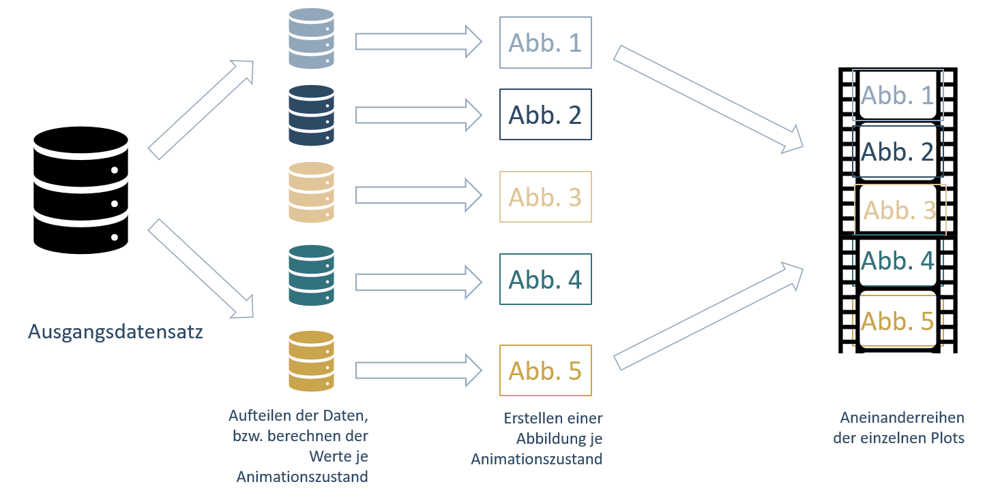

```{r setup, include=FALSE}
knitr::opts_chunk$set(message=FALSE,warning=FALSE,cache=F)
```

----

# Ziele der Sitzung

* Erstellen von Animationen

Die Visualisierung von Daten ist ein wichtiges Instrument in der Kommunikation von Forschungsergebnissen. Statische Abbildungen sind in 99 % der Arbeit der angebrachte Weg. Wissenschaftliche Papiere sind eben immer noch weitestgehend für das Papierformat gedacht. Schon lange weden Forschungsergebnisse jedoch auch online veröffentlicht. Für die Einbettung auf Websites und insbesondere auch in Social-Media-Kanälen bieten animierte Abbildungen eine alternative zu statischen Abbildungen.

* Warum Animationen?

Mit animierten Abbildungen lassen sich insbesondere *Zustandsveränderungen* eindrucksvoll darstellen.

*Zustandsveränderungen* können zum Beispiel Veränderungen einer Variable über die Zeit sein. 

Ein weiteres Beispiel könnte die Visualisierung einer Regression sein, in der die Gruppenzugehörigkeit für ein Individuum geschätzt wird. Die Animation könnte Differenzen zwischen tatsächlicher und im Modell geschätzter Zugehörigkeit visualisieren. 

Auch Simulationsergebnissen könnten in spannender Weise visualisiert werden. Eine Animation könnte die Simulationsergebnisse für verschiedene Modellparameter darstellen. 

Wie bei der Visualisierung statischer Abbildungen, setzt auch bei Animationen lediglich die Fantasie die Grenzen, solange einige Grundprinzipien in der Datenstruktur beachtet werden.

* Grundidee



Die Grundidee bei der Erstellung von Animationen ist die, dass für jeden Animationszustand, zum Beispiel Zeitpunkt, eine eigene Abbildung erstellt wird. Grundvoraussetzung dafür ist, lediglich ein sauberes Datenformat. Soll beispielsweise der Zusammenhang von BIP pro Kopf und Arbeitslosenquote im Zeitverlauf für verschiedene Länder dargestellt werden braucht es genau vier Spalten: (1) BIP pro Kopf (2) Arbeitslosenquote (3) Jahr <-- *Animationszustand* (4) Land.

Das Paket <code>gganimate</code> übernimmt das (fast) alles.

Die Wahl des <code>geom</code> entspricht dabei in der Regel der Wahl, wenn nur eine statische Abbildung für einen Zeitpunkt erstellt würde.

----


### Benötigte Pakete

```{r}
library(tidyverse)
library(gganimate)

#Eventuell muss vor der Nutzung von gganimate noch das Paket gifski installiert werden
#install.packages(gifski)
#Siehe: https://stackoverflow.com/questions/58991580/gganimate-returns-png-files-but-no-animated-object
```

----

### Daten laden

```{r}
library(readr)
(Landkreise_merged <- read_csv("daten_beispiele/Landkreise_merged.csv")
)
```

Wir animieren die Entwicklung der Beziehung zwischen Arbeitslosenquote und BIP über die Zeit in den 401 Kreisen. Eigentlich reihen wir also die gleiche Abbildung für verschiedene Jahre hintereinander. Statisch also:

```{r}
Landkreise_merged %>% 
  filter(!is.na(BIP)) %>% 
  filter(!is.na(Arbeitslosenquote)) %>% 
  ggplot(aes(x = BIP, y = Arbeitslosenquote)) +
  geom_point() +
  facet_wrap(~Jahr)
```


# (1) *Zustände* mit <code>transition_states()</code>

In der Minimalversion müssen wir nur eine Zeile ändern. In <code>transition_states</code> wird der *Animationszustand* eingefügt, in unserem Fall die Beobachtungsjahre.

```{r}
Landkreise_merged %>% 
  filter(!is.na(BIP)) %>% 
  filter(!is.na(Arbeitslosenquote)) %>% 
  ggplot(aes(x = BIP, y = Arbeitslosenquote)) +
  geom_point() +
  transition_states(states = Jahr) 
```


## Dynamische Beschriftungen mit <code>{closest_state}</code>

AHA! Es bewegt sich was! Wir wissen allerdings nicht wirklich, was sich tut. Um besser zu verstehen, was die verschiedenen Zustände darstellen, können wir dynamische Labels verwenden. Innerhalb der geschweiften Klammern wird dann der jeweilige *Animationszustand* angezeigt. <code>{closest_state}</code> kann zum Beispiel in die (Unter)überschrift einer Abbildung eingefügt werden. Das Schöne an <code>gganimate</code> ist es, dass die <code>ggplot</code> weitestgehend übernommen werden kann.

```{r}
Landkreise_merged %>% 
  filter(!is.na(BIP)) %>% 
  filter(!is.na(Arbeitslosenquote)) %>% 
  ggplot(aes(x = BIP, y = Arbeitslosenquote)) +
  geom_point() +
  transition_states(states = Jahr) +
  labs(subtitle = "Jahr: {closest_state}") #<--nimmt Werte aus states-Argument vom transition_states()
```

Die Übergänge sind noch etwas zittrig. Die Übergangszeiten lassen sich als Argumente von <code>transtion_states()</code> anpassen. <code>transtion_length</code> gibt die relative Zeit der Animation an, die für Übergänge verwendet werden soll und <code>transtion_lenth</code> die Zeit, die für die Zustände verwendet wird. Deutlich wird die Funktionsweise, wenn wir weniger *Zustände* nutzen. 

```{r}
Landkreise_merged %>% 
  filter(Jahr %in% c(2000, 2017)) %>% #nur auf Start und Endjahr filtern
  ggplot(aes(x = BIP, y = Arbeitslosenquote)) +
  geom_point() +
  transition_states(states = Jahr,
                    transition_length = 9, #9/10 der Zeit für Übergänge
                    state_length = 1) + #1/10 für Zustände
  labs(subtitle = "Jahr: {closest_state}") #<--nimmt Werte aus states-Argument vom transition_states()
```

## Übergänge gestalten mit <code>ease_aes()</code>

Mit <code>ease_aes()</code> lassen sich Übergänge noch ansprechender gestalten. Standardmäßig sind die Übergänge <code>linear</code>. Es stehen aber zahlreiche andere Optionen zur Verfügung, wie z.B. <code>elastic</code>, <code>bounce</code> oder <code>exponential</code>. 

Zusätzlich können die Übergänge durch ein Suffix weiter angepasst werden. Dabei gibt es drei Optionen, von denen **mindestens eine** gewählt werden muss. 

* <code>-in</code> Standardfall.
* <code>-out</code> Umgekehrtes Verhalten.
* <code>-in-out</code> In der ersten Hälfte des Übergangs Standardfall, in der zweiten umgekehrt.

```{r}
Landkreise_merged %>% 
  filter(Jahr %in% c(2000, 2017)) %>% #nur auf Start und Endjahr filtern
  ggplot(aes(x = BIP, y = Arbeitslosenquote)) +
  geom_point() +
  transition_states(states = Jahr) +
  ease_aes("elastic-in") + # hüpfgummiartiges Verhalten
  labs(subtitle = "Jahr: {closest_state}") #<--nimmt Werte aus states-Argument vom transition_states()
```

## Vorherige Datenpunkte anzeigen mit <code>shadow_</code>

Um die Übergänge zwischen den Zuständen für die einzelnen Beobachtungen noch deutlicher zu machen, kann eine Art *Spur* vom alten *Animationszustand* zum neuen gezeichnet werden, die mit der Zeit verlischt.

Neben der Standardoption (kein *Spur*) gibt es drei <code>shadow_</code>-Optionen:

* <code>shadow_null()</code>: Standard, keine Spur.
* <code>shadow_mark()</code>: Zeigt einzelne Animationszustände. Sowohl vergangene als auch zukünftige Zustände können angezeigt werden.
* <code>shadow_trail()</code>: Zeigt die Spur zwischen den Animationszuständen brotkrumenartig an. Der Weg wird durch einzelne Frames nachgezeichnet.
* <code>shadow_wake()</code>: Die Punkte ziehen auf dem Weg zwischen den Animationszustände eine Heckwelle hinter sich her. Sieht am ehesten aus wie ein Schatten.

Die verschiedenen <code>shadow_</code>-Optionen enthalten wiederum eine Vielzahl an Anpassungsmöglichkeiten.

```{r}
Landkreise_merged %>% 
  filter(Jahr %in% c(2000, 2017)) %>% #nur auf Start und Endjahr filtern
  ggplot(aes(x = BIP, y = Arbeitslosenquote)) +
  geom_point() +
  transition_states(states = Jahr) +
  shadow_wake(wake_length = 0.2) + # "Schatten"" zwischen Animationszuständen
labs(subtitle = "Jahr: {closest_state}") #<--nimmt Werte aus states-Argument vom transition_states()
```

# (2) Datenpunkte *Aufdecken* mit <code>transition_reveal()</code>

Mit <code>transition_reveal()</code> lassen sich Datenpunkte über die Zeit aufdecken und somit klassiche Liniendiagramme mit der Zeit auf der x-Achse animieren. Wir zeigen das mit der Entwicklung der Arbeitslosenquote in den sieben größten deutschen Städten. Statisch:

```{r}
Landkreise_merged %>% 
  filter(!is.na(Arbeitslosenquote)) %>% 
  filter(Raumeinheit %in% c("Berlin, Stadt", "Stuttgart, Stadt", "Düsseldorf, Stadt", "Hamburg, Stadt", "Frankfurt am Main, Stadt", "München, Stadt", "Köln, Stadt")) %>% 
  mutate(Raumeinheit = gsub("(.*),.*", "\\1", Raumeinheit)) %>% #Text ab Komma entfernen, optional
  ggplot(aes(x = Jahr, y = Arbeitslosenquote, color = Raumeinheit)) +
  geom_line() +
  geom_point() 
```

Um die Werte nach und nach aufzudecken braucht es nur einer zusätzlichen Zeile. Hier wird lediglich *Jahr* als Option angegeben, entlang derer die Datenpunkte aufgedeckt werden sollen.

```{r}
Landkreise_merged %>% 
  filter(!is.na(Arbeitslosenquote)) %>% 
  filter(Raumeinheit %in% c("Berlin, Stadt", "Stuttgart, Stadt", "Düsseldorf, Stadt", "Hamburg, Stadt", "Frankfurt am Main, Stadt", "München, Stadt", "Köln, Stadt")) %>% 
  mutate(Raumeinheit = gsub("(.*),.*", "\\1", Raumeinheit)) %>% #Text ab Komma entfernen, optional
  ggplot(aes(x = Jahr, y = Arbeitslosenquote, color = Raumeinheit)) +
  geom_line() +
  geom_point() +
  transition_reveal(along = Jahr) 
```

# (3) Unterschiede zwischen Gruppen mit <code>transition_filter()</code>

<code>transition_filter()</code> lässt uns dynamische Übergänge zwischen Gruppen darstellen. Auch hier können wir wieder dynamische Labels nutzen, um Überblick über die dargestellten Gruppen zu behalten. <code>{closest_filter}</code> übernimmt die Gruppen, die wir in <code>transition_filter()</code> definieren.

Im Folgenden stellen wir den Zusammenhang zwischen Durchschnittsalter und Arbeitslosenquote im Jahr 2017 entlang dreier Gruppen dar. Die Gruppen ergeben sich aus der Wahlbeteiligung.


```{r}
Landkreise_merged %>% 
  filter(Jahr == 2017) %>% #nur auf Jahr 2017 filtern
  ggplot(aes(x = Durchschnittsalter, y = Arbeitslosenquote, color = Wahlbeteiligung)) +
  geom_point() +
  scale_color_viridis_c() + #ein bisschen Farbe
  transition_filter("hoher Wahlbeteilung (> 75 %)" = Wahlbeteiligung > 75,
                    "mittlerer Wahlbeteiligung (70-75 %)" = Wahlbeteiligung <= 75 & Wahlbeteiligung >= 70,
                    "niedriger Wahlbeteilung (< 70 %)" = Wahlbeteiligung < 70) +
  labs(subtitle = "Gruppe der Kreise mit {closest_filter}") #<--nimmt Werte aus states-Argument vom transition_filter()
```

## Erscheinen und Verschwinden mit <code>enter_</code> und <code>exit_</code>

Wir haben die obigen Gruppen exklusiv definiert. Kein Kreis taucht doppelt auf. In solchen Fällen bietet es sich an, diese Trennung durch Übergänge klarer zu machen.

Das Erscheinen und Verschwinden wird mit den <code>enter_</code> und <code>exit_</code>-Varianten definiert. Beispiele sind <code>enter_grow()</code> oder <code>enter_recolor()</code> und die jeweiligen Partnerversionen für das Verschwinden.

Die verschiedenen Optionen lassen sich fast beliebig kombinieren.

```{r}
Landkreise_merged %>% 
  filter(Jahr == 2017) %>% #nur auf Jahr 2017 filtern
  ggplot(aes(x = Durchschnittsalter, y = Arbeitslosenquote, color = Wahlbeteiligung)) +
  geom_point() +
  scale_color_viridis_c() + #ein bisschen Farbe
  transition_filter("hoher Wahlbeteilung (> 75 %)" = Wahlbeteiligung > 75,
                    "mittlerer Wahlbeteiligung (70-75 %)" = Wahlbeteiligung <= 75 & Wahlbeteiligung >= 70,
                    "niedriger Wahlbeteilung (< 70 %)" = Wahlbeteiligung < 70) +
    labs(subtitle = "Gruppe der Kreise mit {closest_filter}") + #<--nimmt Werte aus states-Argument vom transition_filter() 
  enter_fly(x_loc = 0, y_loc = 100) + # Erscheinen: einfliegen von links oben
  exit_fly(x_loc = 100, y_loc = 0) # Verschwinden: rausfliegen nach rechts unten
```


# Speichern einer Animation

Um eine Animation zu speichern, weisen wir zunächst unsere Animation einem <code>gganimate</code>-Objekt zu.

```{r, eval = FALSE}
super_fancy_animation <- Landkreise_merged %>% 
  filter(Jahr == 2017) %>% #nur auf Jahr 2017 filtern
  ggplot(aes(x = Durchschnittsalter, y = Arbeitslosenquote, color = Wahlbeteiligung)) +
  geom_point() +
  scale_color_viridis_c() + #ein bisschen Farbe
  transition_filter("hoher Wahlbeteilung (> 75 %)" = Wahlbeteiligung > 75,
                    "mittlerer Wahlbeteiligung (70-75 %)" = Wahlbeteiligung <= 75 & Wahlbeteiligung >= 70,
                    "niedriger Wahlbeteilung (< 70 %)" = Wahlbeteiligung < 70) +
    labs(subtitle = "Gruppe der Kreise mit {closest_filter}") + #<--nimmt Werte aus states-Argument vom transition_filter() 
  enter_fly(x_loc = 0, y_loc = 20) + # Erscheinen: einfliegen von links oben
  exit_fly(x_loc = 60, y_loc = 0) # Verschwinden: rausfliegen nach rechts unten
```

Danach passen wir noch einige Details der Animation an. Mit <code>nframes</code> bestimmen wir die Gesamtzahl der Frames und mit <code>fps</code> die Frames pro Sekunde. Aus der Kombination der beiden ergibt sich die Gesamtdauer der Animation.

```{r, eval = FALSE}
# adjust the animation settings 
animate(super_fancy_animation, 
        width = 600, # 600px breit
        height = 400, # 400px hoch
        nframes = 150, # insgesamt 100 Frames
        fps = 10) # 10 Frames pro Sekunde --> Gesamte Laufzeit: 15 Sekunden
```

Mit <code>anim_save()</code> speichern wir schließlich die letzte Animation und geben der Datei einen Namen. Und dann? Ab auf Twitter & Co. damit!

```{r, eval = FALSE}
anim_save("meine_super_fancy_animation.gif")
```

