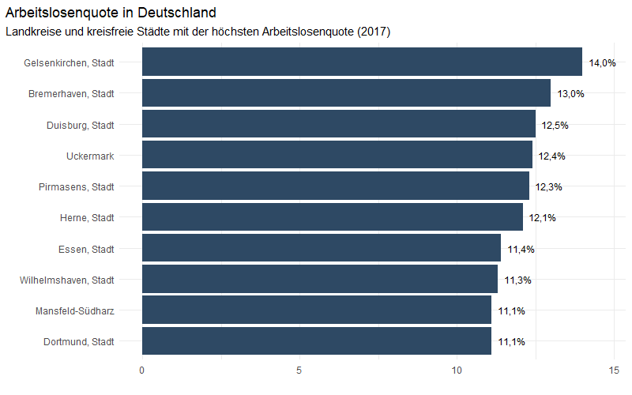
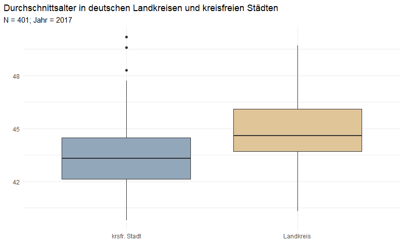
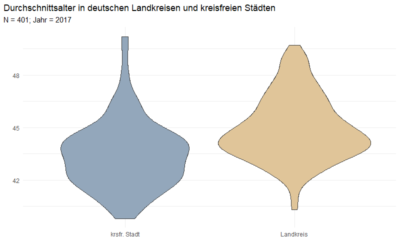

```{r setup, include=FALSE}
knitr::opts_chunk$set(message=FALSE,warning=FALSE, cache=TRUE)
```

---- 

# Balkendiagramme

## Statisches Balkendiagramm

Hier sieht man ein gewöhnliches Balkendiagramm mit vertauschten Axen.

```{r eval=FALSE}
library(tidyverse)

data <- read_csv("../Desktop/Landkreise_merged.csv")

data %>%
    filter(Jahr == 2017) %>%
    top_n(10, Arbeitslosenquote) %>%
    ggplot(aes(x = fct_reorder(Raumeinheit,
                               Arbeitslosenquote),
               y = Arbeitslosenquote)) +
    geom_bar(stat = "identity",
             fill = "#2e4964") +
    geom_text(aes(y = Arbeitslosenquote,
                  label = paste0(format(Arbeitslosenquote,
                                        big.mark = ".",
                                        decimal.mark = ","), "%")),
              nudge_y = 0.65,
              size = 3.2) +
    coord_flip() +
    labs(x = "",
         y = "",
         title = "Arbeitslosenquote in Deutschland",
         subtitle = "Landkreise und kreisfreie Städte mit der höchsten 
                     Arbeitslosenquote (2017)") +
    theme_minimal() +
    theme(plot.title.position = "plot")
```
<center>
{width=70%}
</center>


## Racing Bar Chart (animiert)

Hier wird ein sogenannter "Racing Bar Chart" gezeigt, bei dem sich Veränderungen
der Rangfolge zwischen Untersuchungseinheiten über die Zeit darstellen lassen.
Der Code sieht auf den ersten Blick relativ umständlich aus, lässt sich aber in
weiten Teilen übernehmen und individuell anpassen. Der hier verwendete Trick 
besteht darin, den Datensatz zu erweitern und zwischen ganzen Jahren 
Zwischenschritte zu erzeugen und die fehlenden Daten der darzustellenden 
Variable zu interpolieren. Im konkreten Anwendungsfall werden hierfür zwischen
den Ausprägungen der Jahresvariable (2000, 2001, 2002, etc.) in 0.1er Schritten
(2000.1, 2000.2, 2000.3, ...) Werte für das BIP interpoliert, die in der 
Animation flüssigere Übergänge erzeugen.

```{r eval=FALSE}
library(tidyverse)
library(gganimate)

data <- read_csv("../Desktop/Landkreise_merged.csv")

theme_set(theme_void())

plot <-
    data %>%
    select(Kennziffer, Raumeinheit, Jahr, BIP) %>%
    filter(!is.na(BIP),
           Raumeinheit %in% (data %>%
                                 filter(Jahr == max(Jahr)) %>%
                                 top_n(15, BIP) %>%
                                 pull(Raumeinheit))) %>%
    group_by(Jahr) %>%
    mutate(rank = min_rank(-BIP) * 1) %>%
    group_by(Raumeinheit) %>%
    complete(Jahr = full_seq(Jahr, .1)) %>%
    mutate(BIP = spline(x = Jahr, y = BIP, xout = Jahr)$y) %>%
    # Approx Interpolation für die Rangvariable (spline ist hier zu sprunghaft)
    mutate(rank = approx(x = Jahr, y = rank, xout = Jahr)$y) %>%
    ungroup() %>%
    ggplot(aes(rank, group = Raumeinheit, fill = as.factor(Raumeinheit),
               color = as.factor(Raumeinheit))) +
    geom_tile(aes(y = BIP / 2, height = BIP, width = 0.9),
              alpha = 0.8, color = NA) +
    geom_text(aes(y = BIP, label = paste0(format(round(BIP*1000,0), 
                                                 big.mark = ".", 
                                                 decimal.mark = ","), "€")),
              hjust = 0, nudge_y = 2) +
    geom_text(aes(y = 0, label = paste(Raumeinheit, " ")),
              vjust = 0.2, hjust = 1) +
    coord_flip(clip = "off", expand = FALSE) +
    scale_x_reverse() +
    guides(color = FALSE, fill = FALSE) +
    scale_fill_viridis_d() +
    scale_color_viridis_d() +
    labs(title='BIP pro Landkreis {round(frame_time,0)}',
         subtitle = " ",
         x = "", y = "BIP (je Einwohner)") +
    theme(plot.title = element_text(hjust = -0.5, size = 20),
          axis.ticks.y = element_blank(),
          axis.text.y  = element_blank(),
          plot.margin = margin(1,2,1,6, "cm")) +
    transition_time(Jahr) +
    enter_grow() +
    exit_shrink() +
    ease_aes('cubic-in-out')

# nframes verlangsamt den Plot
animate(plot, fps = 20, width = 750, height = 450, nframes = 400)
anim_save('BIP.gif', animation = last_animation(), path = "../Desktop/")
```

<center>

</center>

---- 

# Boxplot

Von der Strutkur her ähnlich wie Balkendiagramme lassen sich mit <code>geom_boxplot()</code> einfach Boxplots erstellen, die aussagekräftiger sein können als Balkendiagramme. 

## Gewöhnlicher Boxplot

```{r eval=FALSE}
library(tidyverse)

# Einlesen der Beispieldaten
data <- read_csv("../Desktop/Landkreise_merged.csv")

data %>%
    filter(Jahr == 2017) %>%
    ggplot(aes(x = Aggregat, y = Durchschnittsalter,
               fill = Aggregat)) +
    geom_boxplot() +
    labs(x = "",
         y = "",
         title = "Durchschnittsalter in deutschen Landkreisen und kreisfreien Städten",
         subtitle = "N = 401; Jahr = 2017") +
    theme_minimal() +
    scale_fill_manual(values = c("#93a7bb", "#e0c599")) +
     theme(plot.title.position = "plot",
          legend.position = "none")

```
<center>
{width=70%}
</center>

## Violinen-Plot

Eine Alternative zu Boxplots können Violinenplots darstellen, da hier auch 
die Verteilung der jeweiligen Variable dargestellt wird.

```{r eval=FALSE}
library(tidyverse)

# Einlesen der Beispieldaten
data <- read_csv("../Desktop/Landkreise_merged.csv")

data %>%
    filter(Jahr == 2017) %>%
    ggplot(aes(x = Aggregat, y = Durchschnittsalter,
               fill = Aggregat)) +
    geom_violin() +
    labs(x = "",
         y = "",
         title = "Durchschnittsalter in deutschen Landkreisen und kreisfreien Städten",
         subtitle = "N = 401; Jahr = 2017") +
    theme_minimal() +
    scale_fill_manual(values = c("#93a7bb", "#e0c599")) +
     theme(plot.title.position = "plot",
          legend.position = "none")

```
<center>
{width=70%}
</center>


# Statische Karten

Hier visualisieren wir die Arbeitslosenquote in den 401 deutschen Kreisen und kreisfreien Städten auf einer Karte.

## Kontinuierlich

```{r eval=FALSE}
library(tidyverse)
library(ggthemes)
library(sf)
library(Hmisc)

data <- read_csv("daten_beispiele/Landkreise_merged.csv") %>% 
  filter(Jahr == 2017)

shapefile <- st_read("daten_beispiele/shapefiles_kreise/Kreisgrenzen_2017_mit_Einwohnerzahl.shp")

#Daten und Shapefile zusammenführen
data_merged <- shapefile %>% 
  left_join(data, by = c("RS" = "Kennziffer")) 
    
data_merged %>% 
  ggplot(aes(fill = Arbeitslosenquote/100)) +
  geom_sf() +
  scale_fill_gradient(low = "white", high = "#2e4964", guide = "colorbar", labels = scales::percent_format(accuracy = 2)) +
  theme_map() +
  theme(legend.title = element_blank(),
        legend.position = c(1.1, 0.3),
        legend.justification = c("right", "top")) +
   labs(title= "Arbeitslosenquote in Deutschland",
         subtitle = "2017, in Prozent")

ggsave("images/Arbeitslosenquote_2017_kontinuierlich.png")

```

<center>
{width=70%}
</center>

## Gruppiert

In der gruppierten Variante teilen wir die 401 Kreise in 6 Gruppen, die wir dann entsprechend visualisieren. Im Unterschied zum vorherigen Beispiel müssen wir lediglich einige Strings manipulieren, um die entsprechenden Gruppen zu erstellen und die deutsche Kommaregel zu beachten.

```{r eval=FALSE}
library(tidyverse)
library(ggthemes)
library(sf)
library(Hmisc)

data <- read_csv("daten_beispiele/Landkreise_merged.csv") %>% 
  filter(Jahr == 2017) %>% 
  mutate(Gruppen_Arbeitslosenquote = Hmisc::cut2(Arbeitslosenquote, g = 6)) %>% 
  mutate(Gruppen_Arbeitslosenquote = str_replace_all(Gruppen_Arbeitslosenquote, "\\,", " -")) %>% 
  mutate(Gruppen_Arbeitslosenquote = str_replace_all(Gruppen_Arbeitslosenquote, "\\.", "\\,")) %>% 
  group_by(Gruppen_Arbeitslosenquote) %>% 
  mutate(observations = n()) %>% 
  ungroup() %>% 
  mutate(Gruppenbezeichnung = paste(Gruppen_Arbeitslosenquote, ", n = ", observations, sep = ""))

shapefile <- st_read("daten_beispiele/shapefiles_kreise/Kreisgrenzen_2017_mit_Einwohnerzahl.shp")

data_merged <- shapefile %>% 
  left_join(data, by = c("RS" = "Kennziffer")) 

#IW-Farbschema 
meine_IW_Farben <- c("#ca9c4d", "#e0c599", "#f3e2c5", "#93a7bb", "#748a9d", "#2e4964")
    
data_merged %>% 
  ggplot(aes(fill = Gruppenbezeichnung)) +
  geom_sf() +
  scale_fill_manual(values = meine_IW_Farben) +
  theme_map() +
  theme(legend.title = element_blank(),
        legend.position = c(1.1, 0.3),
        legend.justification = c("right", "top")) +
   labs(title= "Arbeitslosenquote in Deutschland",
         subtitle = "2017, in Prozent")

ggsave("images/Arbeitslosenquote_gruppiert_2017.png")
```

<center>
{width=70%}
</center>

## Interaktive Karte (mit Leaflet)

Hier ein Beispiel einer interaktiven Karte mit Leaflet. Da Leaflet eine 
JavaSkript Bibliothek ist, muss hierfür die bekannte ggplot-Logik verlassen
werden. [Hier](https://rstudio.github.io/leaflet/) gibt es eine Einführung für 
Leaflet in R, welche die Grundlagen gut erklärt. Der hier dargestellte Code
sieht auf den ersten Blick relativ umfangreich aus, die meisten Zeilen 
beziehen sich aber auf die Customization der Label und der Legende und lassen
sich mit Copy & Pate und kleinen Anpassungen übernehmen.

```{r eval=FALSE}
# lib ----
library(tidyverse)
library(leaflet)
library(rmapshaper)
library(rgdal)
library(readxl)

# Laden der Daten ----
# Vfa Pharma Unternehmen
pharma_fin <- read_xlsx("pharma_vfa.xlsx")
# An Corona forschende Unternehmen
pharma_corona <- read_xlsx("pharma_corona.xlsx")
# Institutionsdaten
affiliation_full <- read_xlsx("affiliations.xlsx")
# Shapefiles für Deutschland (für Landesgrenzen)
germany <- readOGR(dsn = 'Germany_shapefiles/gadm36_DEU_1.shp')

# Erstellung der Karte ----
# Erstellung der Custom Label für die Karte ----
# Label für Forschungsstandorte
labels <- sprintf(
  '<strong style="font-size:20px">%s</strong><br/>%s Publikationsbeiträge.\n
  <br><strong>Top-Institutionen (Publikationsbeiträge)</strong>
  <br>%s
  <br>%s
  <br>%s',
  substring(affiliation_full$address, 7, length(affiliation_full$address)),
  round(affiliation_full$weigth,2)
) %>%
  lapply(htmltools::HTML)

# Label für vfa Pharma Unternehmen
labels_pharma <- sprintf(
  '<strong style="font-size:20px">%s</strong><br/>%s',
  substring(pharma_fin$Name, 1, length(pharma_fin$Name)),
  paste(pharma_fin$Standort, ".", sep = "")
) %>%
  lapply(htmltools::HTML)

# Label für Corona Forschungseinrichtungen
labels_corona <- sprintf(
  '<strong style="font-size:20px">%s</strong><br/>%s',
  pharma_corona$Unternehmen,
  paste(pharma_corona$Text, ".", sep = "")
) %>%
  lapply(htmltools::HTML)

# Erstellen der Legende ----
addLegendCustom <- function(map, colors, labels, sizes, opacity = 0.75,
                            position = 'bottomleft'){
  colorAdditions <- paste0(colors, "; border-radius: 50%; width:",
                           sizes, "px;margin-top: 3.5px;line-height: ",
                           sizes, "px")
  labelAdditions <- paste0("<div style='display: inline-block;height: ",
                           sizes, "px;margin-top: 2px;line-height: ",
                           sizes, "px;'>",
                           labels, "</div>")
  return(addLegend(map, colors = colorAdditions,
                   labels = labelAdditions, opacity = opacity,
                   position = position))
}

# Plotten der Karte in Leaflet ----
map <-
  leaflet(germany) %>%
  # Einstellung Anfganszoom
  setView(lng = 10.065627, lat = 51.153053, zoom = 6) %>%
  # Plotten der Deutschland-/Bundesländergrenzen
  addPolygons(color = "#444444", weight = 1, smoothFactor =0.5,
              opacity = 5, fillOpacity = 0.15) %>%
  # Hintergrundkarte
  addProviderTiles(providers$OpenStreetMap.DE) %>%
  # Icons für Institutonen
  addCircleMarkers(
    lat = affiliation_full$lat,
    lng = affiliation_full$lon,
    radius = sqrt(affiliation_full$weigth)*5,
    stroke = FALSE,
    col = "#748A9D",
    fillOpacity = 0.75,
    label = labels_3,
    labelOptions = labelOptions(style = list("font-weight" = "normal",
                                             "font-family" = "Source Sans Pro",
                                             padding = "3px 8px",
                                             color = "#2e4964"),
                                textsize = "15px",
                                direction = "auto")) %>%
  # Icons für Pharmaunternehmen (vfa)
  addCircleMarkers(
    lat = pharma_fin$lat,
    lng = pharma_fin$lon,
    stroke = FALSE,
    col = "#32727C",
    fillOpacity = 0.9,
    radius = 5,
    label = labels_pharma,
    labelOptions = labelOptions(style = list("font-weight" = "normal",
                                             "font-family" = "Source Sans Pro",
                                             padding = "3px 8px",
                                             color = "#2e4964"),
                                textsize = "15px",
                                direction = "auto")) %>%
  # Icons für Pharmaunternehmen (Corona Forschung)
  addCircleMarkers(
    lat = pharma_corona$lat,
    lng = pharma_corona$lon,
    stroke = FALSE,
    col = "#2e4964",
    fillOpacity = 0.9,
    radius = 5,
    label = labels_corona,
    labelOptions = labelOptions(style = list("font-weight" = "normal",
                                             "font-family" = "Source Sans Pro",
                                             padding = "3px 8px",
                                             color = "#2e4964"),
                                textsize = "15px",
                                direction = "auto")) %>%
  # Legende
  addLegendCustom(colors = c("#2e4964","#32727C", "#748A9D"),
                  labels = c("Covid-19 Unternehmensprojekte",
                             "Pharma-Unternehmen (vfa)",
                             "Wissenschaftliche Publikationen <br>zu Covid-19"),
                  sizes = c(20, 20, 20),
                  opacity = 0.9)

# Exportieren als .html
htmlwidgets::saveWidget(map, file="map.html")
```

```{r, echo=FALSE,message=FALSE,warning=FALSE, out.width="100%"}
## Skript: Corona Wissenschaft Interktive Karte
## Autor: Armin Mertens
## Datum: 2020-04-29

# libraries --------------------
library(tidyverse)
library(leaflet)
library(rmapshaper)
library(rgdal)
library(readxl)
# ------------------------------

# Deutsche Dezimaltrennweise
options(OutDec= ",")


# Laden der Daten

# Vfa Pharma Unternehmen
pharma_fin <- read_xlsx("daten_beispiele/pharma_vfa.xlsx")
# An Corona forschende Unternehmen
pharma_corona <- read_xlsx("daten_beispiele/pharma_corona.xlsx")
# Laden der Institutionsdaten
affiliation_full <- read_xlsx("daten_beispiele/affiliations.xlsx")
# Laden des Shapefiles für Deutschland (für Landesgrenzen)
germany <- readOGR(dsn = 'daten_beispiele/Germany_shapefiles/gadm36_DEU_1.shp',
                   verbose = FALSE)

# Erstellung der Karte
# Mein Lösung hier ist glaube ich suboptimal bzw. recht aufwändig. Das kann man
# sicher besser machen. War hier dem Umstand geschuldet, dass ich nur einen
# halben Tag Zeit hatte, die Karte zu machen ;) Beim nächsten Projekt werde ich
# mir das nochmal anschauen, ob es hier ne bessere Lösung gibt.
# Subsets für Labels
affiliation_3 <- affiliation_full %>%
  filter(n == 0)

affiliation_2 <- affiliation_full %>%
  filter(n == 1)

affiliation_1 <- affiliation_full %>%
  filter(n == 2)

# Labels für Forschungsstandorte (mit 3 Top-Insitutitonen)
labels_3 <- sprintf(
  '<strong style="font-size:20px">%s</strong><br/>%s Publikationsbeiträge.\n
  <br><strong>Top-Institutionen (Publikationsbeiträge)</strong>
  <br>%s
  <br>%s
  <br>%s',
  substring(affiliation_3$address, 7, length(affiliation_3$address)),
  round(affiliation_3$weigth,2),
  paste("1. ", affiliation_3$Institution_1, " (",
        round(affiliation_3$weigth_1, 2), ").",  sep = ""),
  paste("2. ", affiliation_3$Institution_2, " (",
        round(affiliation_3$weigth_2, 2), ").",  sep = ""),
  paste("3. ", affiliation_3$Institution_3, " (",
        round(affiliation_3$weigth_3, 2), ").",  sep = "")
) %>%
  lapply(htmltools::HTML)

# Labels für Forschungsstandorte (mit 2 Top-Insitutitonen)
labels_2 <- sprintf(
  '<strong style="font-size:20px">%s</strong><br/>%g Publikationsbeiträge.\n
  <br><strong>Top-Institutionen (Publikationsbeiträge)</strong>
  <br>%s
  <br>%s',
  substring(affiliation_2$address, 7, length(affiliation_3$address)),
  round(affiliation_2$weigth,2),
  paste("1. ", affiliation_2$Institution_1, " (",
        round(affiliation_2$weigth_1, 2), ").",  sep = ""),
  paste("2. ", affiliation_2$Institution_2, " (",
        round(affiliation_2$weigth_2, 2), ").",  sep = "")
) %>%
  lapply(htmltools::HTML)

# Labels für Forschungsstandorte (mit 1 Top-Insitutiton)
labels_1 <- sprintf(
  '<strong style="font-size:20px">%s</strong><br/>%g Publikationsbeiträge.\n
  <br><strong>Top-Institutionen (Publikationsbeiträge)</strong>
  <br>%s',
  substring(affiliation_1$address, 7, length(affiliation_3$address)),
  round(affiliation_1$weigth,2),
  paste("1. ", affiliation_1$Institution_1, " (",
        round(affiliation_1$weigth_1, 2), ").",  sep = "")
) %>%
  lapply(htmltools::HTML)

# Labels für vfa Pharma Unternehmen
labels_pharma <- sprintf(
  '<strong style="font-size:20px">%s</strong><br/>%s',
  substring(pharma_fin$Name, 1, length(pharma_fin$Name)),
  paste(pharma_fin$Standort, ".", sep = "")
) %>%
  lapply(htmltools::HTML)

# Labels für Corona Forschungseinrichtungen
labels_corona <- sprintf(
  '<strong style="font-size:20px">%s</strong><br/>%s',
  pharma_corona$Unternehmen,
  paste(pharma_corona$Text, ".", sep = "")
) %>%
  lapply(htmltools::HTML)

# Erstellen der Legende
addLegendCustom <- function(map, colors, labels, sizes, opacity = 0.75,
                            position = 'bottomleft'){
  colorAdditions <- paste0(colors, "; border-radius: 50%; width:",
                           sizes, "px;margin-top: 3.5px;line-height: ",
                           sizes, "px")
  labelAdditions <- paste0("<div style='display: inline-block;height: ",
                           sizes, "px;margin-top: 2px;line-height: ",
                           sizes, "px;'>",
                           labels, "</div>")
  return(addLegend(map, colors = colorAdditions,
                   labels = labelAdditions, opacity = opacity,
                   position = position))
}

# Plotten der Karte in Leaflet
map <-
  leaflet(germany) %>%
  # Einstellung Anfganszoom
  setView(lng = 10.065627, lat = 51.153053, zoom = 5) %>%
  # Plotten der Deutschland/Bundesländergrenzen
  addPolygons(color = "#444444", weight = 1, smoothFactor =0.5,
              opacity = 5, fillOpacity = 0.15) %>%
  # Hintergrundkarte
  addProviderTiles(providers$OpenStreetMap.DE) %>%
  # Icons für Institutonen (3)
  addCircleMarkers(
      lat = affiliation_3$lat,
      lng = affiliation_3$lon,
      radius = sqrt(affiliation_3$weigth)*5,
      stroke = FALSE,
      col = "#748A9D",
      fillOpacity = 0.75,
      label = labels_3,
      labelOptions = labelOptions(style = list("font-weight" = "normal",
                                               "font-family" = "Source Sans Pro",
                                               padding = "3px 8px",
                                               color = "#2e4964"),
                                  textsize = "15px",
                                  direction = "auto")) %>%
  # Icons für Institutonen (2)
  addCircleMarkers(
    lat = affiliation_2$lat,
    lng = affiliation_2$lon,
    radius = sqrt(affiliation_2$weigth)*5,
    stroke = FALSE,
    col = "#748A9D",
    fillOpacity = 0.75,
    label = labels_2,
    labelOptions = labelOptions(style = list("font-weight" = "normal",
                                             "font-family" = "Source Sans Pro",
                                             padding = "3px 8px",
                                             color = "#2e4964"),
                                textsize = "15px",
                                direction = "auto")) %>%
  # Icons für Institutonen (1)
  addCircleMarkers(
    lat = affiliation_1$lat,
    lng = affiliation_1$lon,
    radius = sqrt(affiliation_1$weigth)*5,
    stroke = FALSE,
    col = "#748A9D",
    fillOpacity = 0.75,
    label = labels_1,
    labelOptions = labelOptions(style = list("font-weight" = "normal",
                                             "font-family" = "Source Sans Pro",
                                             padding = "3px 8px",
                                             color = "#2e4964"),
                                textsize = "15px",
                                direction = "auto")) %>%
  # Icons für Pharmaunternehmen (vfa)
  addCircleMarkers(
    lat = pharma_fin$lat,
    lng = pharma_fin$lon,
    stroke = FALSE,
    col = "#32727C",
    fillOpacity = 0.9,
    radius = 5,
    label = labels_pharma,
    labelOptions = labelOptions(style = list("font-weight" = "normal",
                                             "font-family" = "Source Sans Pro",
                                             padding = "3px 8px",
                                             color = "#2e4964"),
                                textsize = "15px",
                                direction = "auto")) %>%
  # Icons für Pharmaunternehmen (Corona Forschung)
  addCircleMarkers(
    lat = pharma_corona$lat,
    lng = pharma_corona$lon,
    stroke = FALSE,
    col = "#2e4964",
    fillOpacity = 0.9,
    radius = 5,
    label = labels_corona,
    labelOptions = labelOptions(style = list("font-weight" = "normal",
                                             "font-family" = "Source Sans Pro",
                                             padding = "3px 8px",
                                             color = "#2e4964"),
                                textsize = "15px",
                                direction = "auto")) %>%
  # Legende
  addLegendCustom(colors = c("#2e4964","#32727C", "#748A9D"),
                  labels = c("Covid-19 Unternehmensprojekte",
                             "Pharma-Unternehmen (vfa)",
                             "Wissenschaftliche Publikationen <br>zu Covid-19"),
                  sizes = c(20, 20, 20),
                  opacity = 0.9)


map
```

