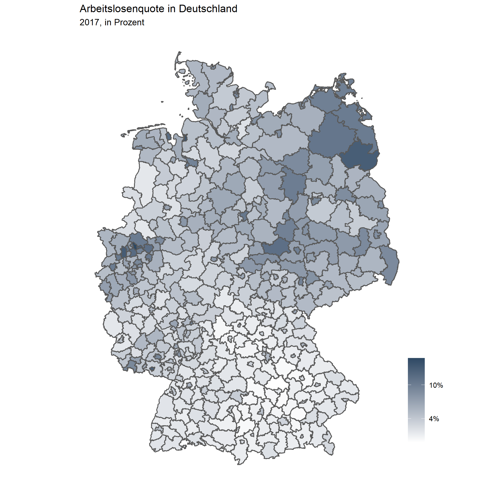
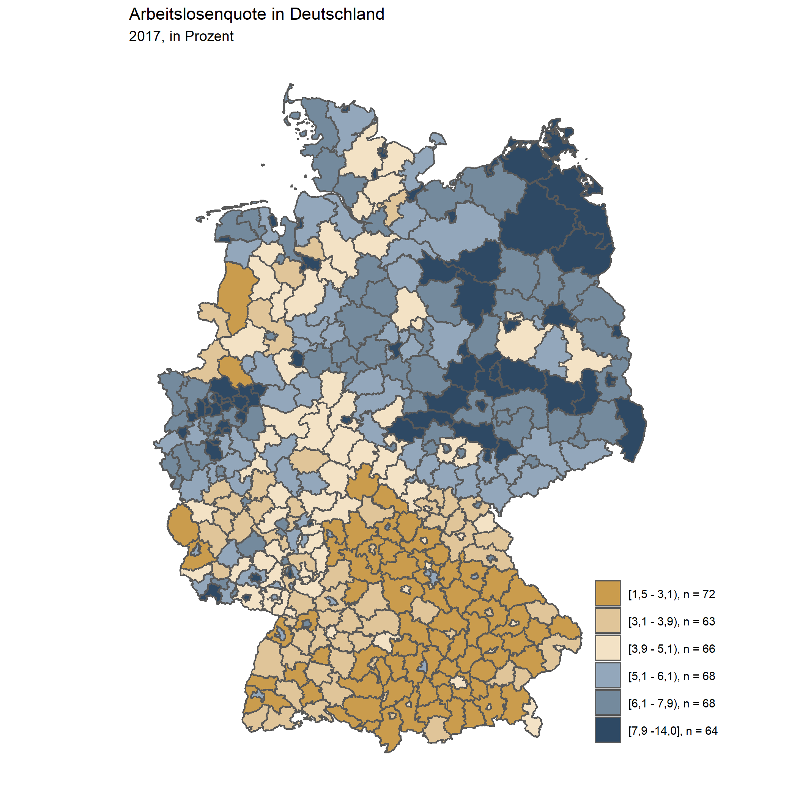

```{r setup, include=FALSE}
knitr::opts_chunk$set(message=FALSE,warning=FALSE, cache=TRUE)
```

---- 

# Racing Bar Chart

Hier wird ein sogenannter "Racing Bar Chart" gezeigt, bei dem sich Veränderungen
der Rangfolge zwischen Untersuchungseinheiten über die Zeit darstellten lassen.
Der Code sieht auf den ersten Blick relativ umständlich aus, lässt sich aber in
weiten Teilen übernehmen und individuell anpassen. Der hier verwendete Trick 
besteht darin, den Datensatz zu erweitern und zwischen ganzen Jahren 
Zwischenschritte zu erzeugen und die fehlenden Daten der darzustellenden 
Variable zu interpolieren. Im konkreten Anwendungsfall werden hierfür zwischen
den Ausprägungen der Jahresvariable (2000, 2001, 2002, etc.) in 0.1er Schritten
(2000.1, 2000.2, 2000.3, ...) Werte für das BIP interpoliert, die in der 
Animation flüssigere Übergänge erzeugen.

```{r eval=FALSE}
# Laden der Pakete
library(tidyverse)
library(gganimate)

# Einlesen der Beispieldaten
data <- read_csv("../Desktop/Landkreise_merged.csv")

# Set Theme
theme_set(theme_void())

plot <-
    data %>%
    select(Kennziffer, Raumeinheit, Jahr, BIP) %>%
    # Filtern der Top 15 Landkreise nach BIP im Jahr 2017
    filter(!is.na(BIP),
           Raumeinheit %in% (data %>%
                                 filter(Jahr == max(Jahr)) %>%
                                 top_n(15, BIP) %>%
                                 pull(Raumeinheit))) %>%
    group_by(Jahr) %>%
    # Erstellen einer Rangfolgevariable
    mutate(rank = min_rank(-BIP) * 1) %>%
    # Hier wird der Datensatz erweitert, um in der Animation flüssigere
    # Übergänge zu erzeugen.
    # Dafür wird zünächst die Jahresvariable um jeweils 0.1 erweitert und die
    # fehlenden Werte des BIP zwischen den vorhanden Werten interpoliert
    group_by(Raumeinheit) %>%
    complete(Jahr = full_seq(Jahr, .1)) %>%
    # Spline Interpolation für das BIP
    mutate(BIP = spline(x = Jahr, y = BIP, xout = Jahr)$y) %>%
    # Approx Interpolation für die Rangvariable (spline ist hier zu sprunghaft)
    mutate(rank = approx(x = Jahr, y = rank, xout = Jahr)$y) %>%
    ungroup() %>%
    # Übergabe der Daten in ggplot
    ggplot(aes(rank,
               group = Raumeinheit,
               fill = as.factor(Raumeinheit),
               color = as.factor(Raumeinheit))) +
    geom_tile(aes(y = BIP / 2,
                  height = BIP,
                  width = 0.9),
              alpha = 0.8,
              color = NA) +
    # Label der Balken (rechts)
    geom_text(aes(y = BIP,
                  label = paste0(format(round(BIP*1000,0),
                                        big.mark = ".",
                                        decimal.mark = ","), "€")),
              hjust = 0,
              nudge_y = 2) +
    # Label der Balken (links)
    geom_text(aes(y = 0,
                  label = paste(Raumeinheit, " ")),
              vjust = 0.2,
              hjust = 1) +
    coord_flip(clip = "off",
               expand = FALSE) +
    scale_x_reverse() +
    guides(color = FALSE,
           fill = FALSE) +
    # Ändern der Standardfarben
    scale_fill_viridis_d() +
    scale_color_viridis_d() +
    # Hinzfügen des Titel (dynamische Angabe des jeweiligen Jahres)
    labs(title='BIP pro Landkreis {round(frame_time,0)}',
         subtitle = " ",
         x = "", y = "BIP (je Einwohner)") +
    theme(plot.title = element_text(hjust = -0.5, size = 20),
          axis.ticks.y = element_blank(),
          axis.text.y  = element_blank(),
          plot.margin = margin(1,2,1,6, "cm")) +
    transition_time(Jahr) +
    enter_grow() +
    exit_shrink() +
    ease_aes('cubic-in-out')

# Speichern der Animation
# nframes verlangsamt den Plot
animate(plot, fps = 20, width = 750, height = 450, nframes = 400)
anim_save('BIP.gif', animation = last_animation(), path = "../Desktop/")
```


---- 

# Statische Karten

Hier visualisieren wir die Arbeitslosenquote in den 401 deutschen Kreisen und kreisfreien Städten.

## Kontinuierlich

```{r eval=FALSE}
# Laden der Pakete
library(tidyverse)
library(ggthemes)
library(sf)
library(Hmisc)

# Einlesen und Gruppieren der Daten
data <- read_csv("daten_beispiele/Landkreise_merged.csv") %>% 
  filter(Jahr == 2017)

#Einlesen des Shapefiles
shapefile <- st_read("daten_beispiele/shapefiles_kreise/Kreisgrenzen_2017_mit_Einwohnerzahl.shp")

#Daten und Shapefile zusammenführen
data_merged <- shapefile %>% 
  left_join(data, by = c("RS" = "Kennziffer")) 

#Plot erstellen:
    
data_merged %>% 
  ggplot(aes(fill = Arbeitslosenquote/100)) +
  geom_sf() +
  scale_fill_gradient(low = "white", high = "#2e4964", guide = "colorbar", labels = scales::percent_format(accuracy = 2)) +
  theme_map() +
  theme(legend.title = element_blank(),
        legend.position = c(1.1, 0.3),
        legend.justification = c("right", "top")) +
   labs(title= "Arbeitslosenquote in Deutschland",
         subtitle = "2017, in Prozent")

#Speichern des Plots
ggsave("images/Arbeitslosenquote_2017_kontinuierlich.png")

```



## Gruppiert

In der gruppierten Variante teilen wir die 401 Kreise in 6 Gruppen, die wir dann ensprechend visualisieren. Im Unterschied zum vorherigen Beispiel müssen wir lediglich einige Strings manipulieren, um die entsprechenden Gruppen zu erstellen und die deutsche Kommaregel zu beachten.

```{r eval=FALSE}
# Laden der Pakete
library(tidyverse)
library(ggthemes)
library(sf)
library(Hmisc)

# Einlesen und Gruppieren der Daten
data <- read_csv("daten_beispiele/Landkreise_merged.csv") %>% 
  filter(Jahr == 2017) %>% 
  mutate(Gruppen_Arbeitslosenquote = Hmisc::cut2(Arbeitslosenquote, g = 6)) %>% 
  mutate(Gruppen_Arbeitslosenquote = str_replace_all(Gruppen_Arbeitslosenquote, "\\,", " -")) %>% 
  mutate(Gruppen_Arbeitslosenquote = str_replace_all(Gruppen_Arbeitslosenquote, "\\.", "\\,")) %>% 
  group_by(Gruppen_Arbeitslosenquote) %>% 
  mutate(observations = n()) %>% 
  ungroup() %>% 
  mutate(Gruppenbezeichnung = paste(Gruppen_Arbeitslosenquote, ", n = ", observations, sep = ""))

#Einlesen des Shapefiles
shapefile <- st_read("daten_beispiele/shapefiles_kreise/Kreisgrenzen_2017_mit_Einwohnerzahl.shp")

#Daten und Shapefile zusammenführen
data_merged <- shapefile %>% 
  left_join(data, by = c("RS" = "Kennziffer")) 

#Plot erstellen:
  #IW-Farbschema 
    meine_IW_Farben <- c("#ca9c4d", "#e0c599", "#f3e2c5", "#93a7bb", "#748a9d", "#2e4964")
    
data_merged %>% 
  ggplot(aes(fill = Gruppenbezeichnung)) +
  geom_sf() +
  scale_fill_manual(values = meine_IW_Farben) +
  theme_map() +
  theme(legend.title = element_blank(),
        legend.position = c(1.1, 0.3),
        legend.justification = c("right", "top")) +
   labs(title= "Arbeitslosenquote in Deutschland",
         subtitle = "2017, in Prozent")

#Speichern des Plots
ggsave("images/Arbeitslosenquote_gruppiert_2017.png")
```


