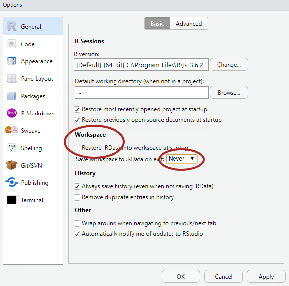

```{r setup, include=FALSE}
knitr::opts_chunk$set(message=FALSE,warning=FALSE, cache=TRUE)
```

---- 

# Ziele der Sitzung

* Verständnis der Grundfunktion von RStudio
* Erweiterte Einstellungen
* Erstellung eines Projektes
* Gutes Setup für Datenanalyse und Datenvisualisierung mit R

----

# R und RStudio installieren 

Wenn IW-Laptops benutzt werden, sollten R und RStudio bereits von der IT installiert bzw. aktualisiert worden sein. Auf privaten Laptops müssen R und RStudio selbst installiert werden. Falls sich schon ältere Versionen auf den Laptops befinden, sollten diese auf die untenstehnden Versionen aktualisiert werden:

* Für **R** wird **Version 4.0.3** (Bunny-Wunnies Freak Out) verwendet ([Link](https://ftp.fau.de/cran/)). Andere Versionen ab R 4.0 sollten aber keine Probleme für den Kurs verursachen und können auch verwendet werden.
* Eine aktuelle Version von **RStudio** kann hier heruntergeladen werden ([Link](https://rstudio.com/products/rstudio/download/#download))

Wie oben beschrieben, können die Kursinhalte auch mit älteren Versionen bearbeitet werden. Für eine Minimierung möglicher Fehler macht es aber Sinn, dass alle Kursteilnehmer mit den gleichen Versionen arbeiten. 

----

# RStudio verstehen

[RStudio](https://rstudio.com/) ist ein integrierte Entwicklungsumgebung (IDE) und graphische Benutzeroberflächer für R. RStudio ist als lokale Desktop-Version, als Server Version und auch in der Cloud verfügbar. Auch wenn R und R-Skripte über die Konsole gestartet werden können, bietet R-Studio gerade für Anfänger einige Komfortfunktionen, die die Datenanalyse vereinfachen. Diese Funktionen umfassen unter anderem die Organisation von Analysen und Daten in Projekten (siehe unten), die Möglichkeit Datensätze interaktiv zu betrachten, die Visualisierung von Daten und die direkte Integration von Versionsverwaltung mit [Git](https://git-scm.com/). 

----

## Das Layout von R-Studio
<center>

{width=75%}

</center>

Das Grundlayout von R-Studio besteht aus vier Fenstern. Diese sind wie oben
angeordnet und können funktional folgendermaßen unterschieden werden:

* Fenster 1: Das Fenster enthält das Hauptskript oder ggf. den Viewer (hiermit können Datensätze (ohne Schreibfunktion) betrachtet werden)

* Fenster 2: Beinhaltet die Umgebungsübersicht. Alle Objekte und Variablen die erstellt wurden, können hier betrachtet werden.

* Fenster 3: Hier befindet sich die Konsole.

* Fenster 4: Beinhaltet ein Übersicht über alle Dateien im Ordner / Plots / Pakete / oder die Hilfe.

Über <code>Tools > Global Options > Pane Layout</code> können diese Fenster nach belieben angeordnet und ein- bzw. ausgeblendet werden. 

----

## Erweiterte Einstellungen

Wenn man R-Studio das erste mal benutzt, macht es Sinn, einige Einstellungen zu verändern, die standardmäßig eingestellt sind. 

Hier macht es Sinn, sich unter 'Tools > Global Options' einmal die verschiedenen Optionen anzuschauen. 

<center>

{width=50%}

</center>

Zwei wichtige Einstellungen sind (unserer Meinung nach):

1. den Haken bei "Restore .RData into workspace at start-up" zu entfernen und 
2. die Option bei "Save workspace to .RData on exit" auf "Never" zu setzen. 

In Einzelfällen kann es sinnvoll sein, Daten und Zuweisungen aus der letzten Sitzung automatisch in der nächsten Sitzung zu importieren. Öfter kann dies aber zu Verwirrung oder sogar zu Fehlern führen. Vor allem schulen die Einstellungen darin, alle Ergebnisse reprozudiertbar in Skripten zu speichern. 

Des Weiteren macht es Sinn, sich unter <code>Tools > Global Options > Appearance</code> mit den verfügbaren Optionen auseinanderzusetzen. Hier lassen sich etwa Schriftart und -größe sowie das generelle Theme von R-Studio einstellen. Wenn man längere Zeit vor R-Studio sitzt (was durchaus zu empfehlen ist), kann es Sinn machen, einen Darkmode zu nutzen, um die Augen zu schonen. 

----

## R-Studio Shortcuts

In R-Studio gibt es eine ganze Reihe an Shortcuts, die das Coden deutlich vereinfachen und beschleunigen können. Eine relativ umfrangreiche Übersicht gibt es [hier](https://support.rstudio.com/hc/en-us/articles/200711853-Keyboard-Shortcuts). Folgende Shortcuts sind unserer Meinung nach unerlässlich für den alltäglichen Gebrauch von R-Studio. Diese Auswahl kann aber nach Belieben erweitert werden.

Beschreibung                          Shortcut (Windows)  Shortcut (Mac) 
--------------------------------      ------------------- ---------------
Bewegen des Cursors zur Konsole       Ctrl+2              Ctrl+2
Leeren der Konsole                    Ctrl+L              Ctrl+L
Abbrechen des ausgeführten Befehls    Esc                 Esc
Neues Skript                          Ctrl+Shift+N        Cmd+Shift+N
Speichern des aktiven Dokuments       Ctrl+S              Ctrl+S
Assignment Operator                   Alt+-               Option+-
Pipe Operator                         Ctrl+Shift+M        Cmd+Shift+M
Autocompletion                        Tab                 Tab
Shortcut Übersicht                    Alt+Shift+K         Option+Shift+K
Neustart der R Session                Ctrl+Shift+F10      Ctrl+Shift+F10

----

# Erstellung von Projekten

Ein allgemeine Empfehlung besteht in der Erstellung eines neuen Projektes für jedes Analysvorhaben. Projekte bieten die Möglichkeit, alle wichtigen Dateien, Skripte und Ergebnisse an einem Ort zu organisieren. Der wichtigste Vorteils eines R-Studio-Projekts besteht aber darin, dass die automatisch erstellte .RProj-Datei den relativen Dateipfad festsetzt, von der aus alle Dateien abgerufen werden können. 

Generell kann das Working Directory auch durch <code>setwd()</code> festgelet werden.
```{r, eval=FALSE}
setwd('C:/Users/amertens/IW-R-Kurs/)
```
Dies hat den Nachteil, dass so ein absoulter Dateiffad festegesetzt wird. Verschiebt man den Ordner, kann dieser Dateipfad schnell ungeültig werden. Noch wichtiger ist allerdings der Umstand, dass bei Teilen des Ordners oder bei kollaborativem Arbeiten an einem Projekt niemand außer dem Autor des Skripts den korrekten Pfad gespeichert hat. Deshalb gilt: wer seinem zukünftigen Ich und anderen einen Gefallen tun will, nutzt R-Studio Projekte.

Projekte können unter <code>File > New Project</code> erstellt werden.

<center>

{width=50%}

</center>

Im dann erscheinenden Fenster besteht die Möglichkeit, für ein Projekt einen neuen Ordner anzulegen, einen schon bestehnden Ordner zu verwenden oder ein Projekt mit Versionskontrolle (z.B. git zu benutzen). Generell empfiehlt sich hier zunächst, einen neuen Ordner für jedes Projekt anzulegen.

<center>

{width=50%}

</center>

Im nächsten Fenster wählt man noch einmal die Option 'New Project'. Hier bestehen zudem noch die Option ein neues R-Paket oder eine Shiny App zu erstellen.

<center>

{width=50%}

</center>

Im letzten Schritt gibt man den Namen des Ordners / des Projektes sowie den Pfad des Ordners an. Arbeitet man mit Versionskontrolle, besteht hier zudem die Möglichkeit, das Projekte bzw. den Ordner direkt mit git zu initialisieren.

Im nächsten Kapitel sollen die Vorteile von R-Studio Projekten anhand von Beispielen deutlich gemacht werden.

----

# Weiterführende Informationen

Hier werden eine Reihe von Links mit weiterführenden Informationen zu RStudio-Projekten aufgeführt. Wenn man plant, R und Rstudio häufiger zu nutzen, macht es Sinn, sich vor allem am Anfang mit den Grundlagen vernünftiger Projekt- und Ordnerverwaltung auseinander zu setzten. Einmal erlernte suboptimale Vorgehensweise sind später oft schwieriger zu korrigieren. Die folgenden Links können dabei helfen:

* [Chris von Csefalvay - Structuring R Projects](https://chrisvoncsefalvay.com/2018/08/09/structuring-r-projects/)

* [Martin Chan - RStudio Projects and Working Directories - A Beginners Guide](https://www.r-bloggers.com/2020/01/rstudio-projects-and-working-directories-a-beginners-guide/)

* [R4DS - Workflow: projects](https://r4ds.had.co.nz/workflow-projects.html)