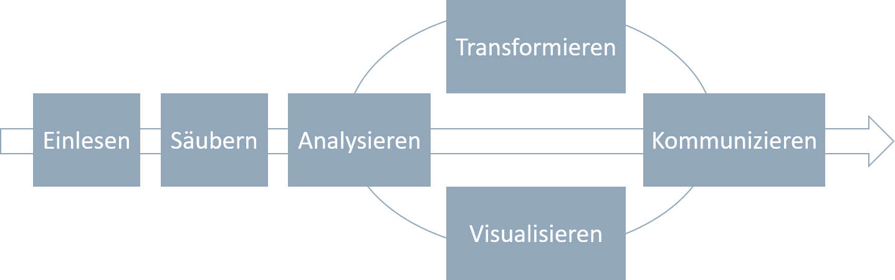
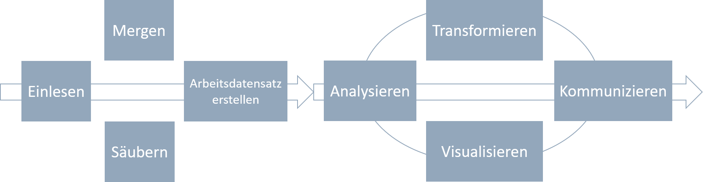
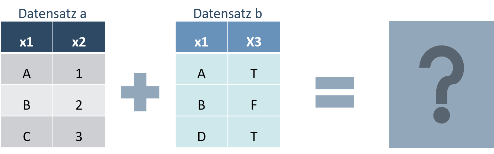
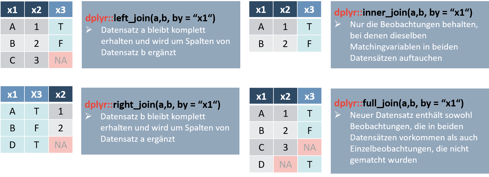

```{r setup, include=FALSE}
knitr::opts_chunk$set(message=FALSE,warning=FALSE, cache=F)
```

----

# Ziele der Sitzung

* Setup eines effizienten Workflows für die Analyse von großen (Mikro-)Datensätzen
* Mergen aus verschiedenen Datensätzen
* Erstellen eines Arbeitsdatensatzes
* Deskriptive Statistiken (numerisch und grafisch)
* Gewichtete Statistiken

----

# Setup eines effizienten Workflows

----

## Grundidee

Mikrodatensätze wirken häufig komplex. Grund hierfür sind sicherlich die Dimensionen der Datensätze. Viele Beobachtungen (Zeilen!) treffen auf viele Variablen (Spalten!)

Bei der Datenanalyse unterscheiden sich die Workflows in der Grundstruktur kaum von der Analyse anderer *kleinerer* Datensätze:

1. Daten einlesen
2. Daten säubern
3. Daten analysieren
4. Daten transformieren
5. Daten visualisieren
6. Daten kommunizieren


Quelle: Vgl. [R4DS](https://bookdown.org/asmundhreinn/r4ds-master/wrangle-intro.html)

In der Praxis geht es meist nicht so geradlinig zu. Insbesondere bei großen Datensätzen kann es sinnvol sein, einige Zwischenschritte einzubauen. 

Bei der Arbeit mit Mikrodatensätzen müssen in der Regel verschiedene Datensätze zu einem Arbeitsdatensatz zusammengeführt werden. 

Das Zusammenführen der Daten kann, je nach Größe der Datensätze einige Zeit in Anspruch nehmen. Um zu Vermeiden, den Arbeitsdatensatz ständig auf's Neue zusammenzufügen, sollte ein Arbeitsdatensatz gespeichert werden.

An diesem sollten, außer dem Zusammenführen der Daten, noch keine Änderungen vergenommen worden sein. Das Verändern der Daten erfolgt erst in einem späteren Schritt. Geht im Verlaufe der Datenanalyse etwas schief und der Arbeitsdatensatz wird ausversehen überschrieben, kann schnell die Erstversion wiederhergestellt werden. Ein erneutes Zusammenstellen der Daten wird vermieden.

Ein effizienter Workflow bei der Analyse großer Datenmengen aus verschiedenen Quellen könnte also so aussehen:


Quelle: Adaptiert von [R4DS](https://bookdown.org/asmundhreinn/r4ds-master/wrangle-intro.html)

----

## Ordnerstruktur

Ein effizienter Workflow beginnt bei einer effizienten Ordnerstruktur. Dabei sollte mir R-Projekten gearbeitet werden. Eine beispielhafte Ordnerstruktur könnte so aussehen:
```{r echo = FALSE}
library(fs)
fs::dir_tree("Beispielordner_Mikrodatenanalyse", recurse = TRUE)
```
Der Projektordner <code> Beispielordner_Mikrodatenanalyse </code> enthält alle relevanten Dateien. In der ersten Ebene liegt die .Rproj-Datei (<code>Projekt_Mikrodatenanalyse.Rproj</code>), .R-Dateien und Unterordner.

Ausgehend vom Projektordner, in dem die .Rproj-Datei liegt, können beliebige Unterordner gebildet werden. Alternativ zur obigen Struktur könnten die .R-Dateien auch in einen eigenen Ordner verschoben werden.

Andere Beispiele für Ordnerstrukturen finden sich zum Beispiel hier:

* [RStudio Projects and Working Directories: A Beginner's Guide](https://martinctc.github.io/blog/rstudio-projects-and-working-directories-a-beginner's-guide/)

* [Bookdown: How to organize a project folder](https://bookdown.org/lyzhang10/lzhang_r_tips_book/how-to-organize-a-project-folder.html)
 
* [RStudio: Using Projects](https://support.rstudio.com/hc/en-us/articles/200526207-Using-Projects)

----

# Mikrodatenanalyse Praxisbeispiel

## Daten einlesen

### Problem: 

Mikrodaten werden in der Regel (noch) nicht in einem R-Datenformat ausgeliefert. Häufig sind zunächst nur dta-Dateien (Stata) oder sav-Dateien (SPSS) verfügbar.

###Lösung: 

Das Paket <code>haven</code> ermöglicht das Einlesen *fremder* Dateitypen.

```{r haven_installieren, eval = FALSE}
#Einmalig installieren
install.packages("haven")
```

```{r haven_laden}
#Laden
library(haven)
```

Das Paket bietet verschiedene Funktionen, um fremde Dateiformate einzulesen, und diese zu speichern. Stata oder SPSS-Nutzer sind zudem die Arbeit mit *Labeln* gewohnt. In R wird dies standardmäßig nicht unterstützt. <code>haven</code> enthält verschiedene Funktionen, um Label zu definieren, ändern, löschen, usw.:

```{r}
#Liste aller Funktionen im Paket haven
ls("package:haven")
```

Bei der Arbeit mit Mikrodatensätzen liegt die erste Hürde im Zusammentragen der Datensätze. Beispielhaft soll dies anhand dreier Datensätze demonstriert werden. Die Datensätze basieren auf dem frei zugänglichen [SOEP-Übungsdatensatz](https://www.diw.de/de/diw_02.c.222838.de/soep_in_der_lehre.html). Dieser wurde um weitere Variablen ergänzt und für einen realistischeren Anwendungsfall aufgesplittet. Die Variablen sind verfremdet, beziehungsweise auf Zufallsbasis erstellt.

Für unsere Mikrodatenanalyse nutzen wir drei Datensätze:  <code>ppathl.dta</code>, <code>pl.sav</code>, <code>phealth.dta</code>. Wir lesen diese mit den Befehlen <code>read_dta()</code> beziehungsweise <code>read_sav()</code> aus dem Paket <code>haven</code> ein.


```{r}
ppathl <- read_dta("Beispielordner_Mikrodatenanalyse/data_in/ppathl.dta")
pl <- read_sav("Beispielordner_Mikrodatenanalyse/data_in/pl.sav")
phealth <- read_dta("Beispielordner_Mikrodatenanalyse/data_in/phealth.dta")
```
Wie immer sollten die Datensätze zunächst inspiziert werden:
```{r}
ppathl
pl
phealth
```
Ein Teil der Variablen ist vom Typ <code>haven_labelled</code>, angezeigt durch <code><dbl+lbl></code>. Für Statanutzer ist dies nichts Neues. Dies bedeutet lediglich, dass die Variablen neben dem eigentlichen Variablennamen noch eine Kurzbeschreibung tragen. <code><dbl+lbl></code> zeigt an, dass die Variable numerisch ist (<code><dbl></code>) und ein Label trägt <code><+lbl></code>.

Um die drei Datensätze zusammenzufügen nutzen wir die beiden Matching-Variablen <code>persnr</code> und <code>jahr</code>.

Optional: Standardmäßig zeigt R keine Änderungen an Datensätzen in der Konsole an. Wer gerne Feedback für Datenmanipulationen und auch Mergevorgänge möchte, der kann hierfür das Paket <code>tidylog</code> nutzen. Das Paket bietet Informationen für eine Vielzahl an Datenmanipulationsfunktionen aus dem tidyverse.


```{r}
library(tidyverse)
library(tidylog)
ls("package:tidylog")
```

----

## Datensätze zusammenführen



Um Datensätze zusammenzuführen werden die <code>Mutating Joins</code>-Funktionen genutzt. Die vier Funktionen aus dem Paket <code>dplyr</code> welches Teil des <code>tidyverse</code> ist, sind:

* <code>Neuer_Datensatz <- left_join(Datensatz1, Datensatz2, by = c("Matchingvariable1", "Matchingvariable2"))</code>: Datensatz1 bleibt komplett erhalten und wird um Spalten von Datensatz2 ergänzt.

* <code>Neuer_Datensatz <- right_join(Datensatz1, Datensatz2, by = c("Matchingvariable1", "Matchingvariable2"))</code>: Datensatz2 bleibt komplett erhalten und wird um Spalten von Datensatz1 ergänzt.

* <code>Neuer_Datensatz <- inner_join(Datensatz1, Datensatz2, by = c("Matchingvariable1", "Matchingvariable2"))</code>: Nur die Beobachtungen behalten, bei denen dieselben Matchingvariablen in beiden Datensätzen auftauchen.

* <code>Neuer_Datensatz <- full_join(Datensatz1, Datensatz2, by = c("Matchingvariable1", "Matchingvariable2"))</code>: Neuer Datensatz enthält sowohl Beobachtungen, die in beiden Datensätzen vorkommen als auch Einzelbeobachtungen, die nicht gematcht wurden.



Quelle: [Data Wrangling Cheat Sheet]("https://rstudio.com/wp-content/uploads/2015/02/data-wrangling-cheatsheet.pdf")

----

##Reihenfolge des Zusammenfügens bei Mikrodatensätzen

Bei der Arbeit mit Mikrodatensätzen beginnt man in der Regel mit einem Basisdatensatz, in unserem Fall <code>ppathl</code>. Dieser enthält in der Regel alle Beobachtungen. Aufbauend auf diesem Datensatz werden weitere Informationen hinzugefügt. Wir wissen also, dass wir an  <code>ppathl</code> alle anderen Datensätze dranspielen können. In unserem finalen Datensatz sind alle Zeilen aus <code>ppathl</code> enthalten, ergänzt um weitere Variablen aus den anderen Datensätzen. Wir nutzen also den <code>left_join</code>. 

Um einen Arbeitsdatensatz aus mehreren Datensätzen zu erstellen, kann man schrittweise vorgehen:

```{r}
#1. Schritt
zwischendatensatz1 <- left_join(ppathl, pl, by = c("persnr", "jahr"))
```
```{r}
#2. Schritt
arbeitsdatensatz_mit_zwischenschritt <- left_join(zwischendatensatz1, phealth, by = c("persnr", "jahr"))
```
Wer sich sicher fühlt  nutzt den Pipe-Befehl und kombiniert die beiden Schritte. 
```{r}
library(tidyverse)
arbeitsdatensatz <- ppathl %>% #Ausgangsdatensatz ppathl
  left_join(pl, by = c("persnr", "jahr")) %>% #1. Schritt
  left_join(phealth, by = c("persnr", "jahr")) #2. Schritt
```

Das Ergebnis ist identisch:
```{r}
library(waldo)
waldo::compare(arbeitsdatensatz, arbeitsdatensatz_mit_zwischenschritt)
```

An dieser Stelle bietet es sich an, den Arbeitsdatensatz oder vielleicht sogar alle bisher geladenen und erstellten Objekte (z.B. Datensätze) abzuspeichern. Mit <code>saveRDS</code> kann ein einzelnes R-Objekt gespeichert werden. <code>readRDS</code> lädt dieses ein.

```{r eval = FALSE}
# Einzelnes Objekt speichern:
saveRDS(object = arbeitsdatensatz, file = "arbeitsdatensatz.rds")
# Einzelnes Objekt laden:
arbeitsdatensatz <- readRDS("arbeitsdatensatz.rds")
```


Sollen alle bisher erstellten Obejekte gespeichert werden, geschieht dies mit <code>save.image</code>. Geladen wird mit dem Befehl <code>load</code>.

```{r eval = FALSE}
# Gesamten Workspace speichern:
save.image(file = "arbeitsdatensatz.RData")
```

```{r eval = FALSE}
# Und wieder laden
load("arbeitsdatensatz.RData")
```

----

##Analyse von Mikrodaten

Die große Anzahl an Beobachtungen kann die (effiziente) Visualisierung von Mikrodaten erschweren und einige Visualisierungsformen bieten sich mehr an als andere. Entscheidend ist der Datentyp, der visualisiert werden soll.

Sollen lediglich aggregierte Werte, wie beispielsweise Mittelwerte, Quantile und Dispersionsmaße dargestellt werden, unterscheidet sich die Datenvisualisierung von Mikrodaten nicht von der von anderen Daten. Lediglich bei der Datenanalyse muss auf die Gewichtung der Daten geachtet werden.

###Gewichte (Hochrechnungsfaktoren)
Um für die Grundgesamtheit repräsentative Ergebnisse zu erhalten, müssen die Daten aus der Stichprobe gewichtet werden. Wie immer kann ein gewünschtes Ergebnis, hier zum Beispiel die durchschnittlichen Einkommen im Jahr 2004, *händisch* berechnet werden.


```{r include = TRUE}
arbeitsdatensatz %>%
  filter(jahr == 2004) %>%
  summarise(income_mean_weighted = sum(income*weight)/sum(weight)) 
```
In der Regel hat sich jedoch schon jemand die Mühe gemacht und eine Funktion geschrieben:

```{r include = TRUE}
arbeitsdatensatz %>%
  filter(jahr == 2004) %>%
  summarise(income_mean_weighted = weighted.mean(x = income, w = weight))
```

So bietet zum Beispiel das Paket <code>spatstat</code> Funktionen, die für die Berechnung deskriptiver, gewichteter Statistiken sinnvoll sind. 
```{r}
library(spatstat)
ls("package:spatstat") %>% 
  as_tibble() %>% 
  filter(stringr::str_detect(value, "weighted"))
```

Die Anwendung dieser Funktionen funktioniert genau wie in unseren bisherigen Beispielen. Sind wir an der Entwicklung des gewichteten Medianeinkommens über die Zeit interessiert, bestimmen wir diese mit:

```{r}
arbeitsdatensatz %>% 
  group_by(jahr) %>% 
  summarise(income_weighted_median = spatstat::weighted.median(income, weight, na.rm = T)) %>% 
  ungroup()
```

Als Visualisierung:

```{r}
arbeitsdatensatz %>% 
  group_by(jahr) %>% 
  summarise(income_weighted_median = spatstat::weighted.median(income, weight, na.rm = T)) %>% 
  ggplot(aes(x = factor(jahr), y = income_weighted_median, group = 1)) +
  geom_line(linetype = "dashed") +
  geom_point(aes(color = factor(jahr)), size = 5) 
```

Insbesondere bei Daten mit vielen Beobachtungen kann es spannend sein, die Verteilung der Variblen von Interesse zu visualisieren. Ein Klassiker ist der Boxplot.

```{r}
arbeitsdatensatz %>% 
  ggplot(aes(x = factor(jahr), y = lebensz_org, color = factor(jahr), weight = weight)) +
  geom_boxplot()
```

Der klassiche Boxplot gibt zwar einige Hinweise auf die Verteilung der Daten, es geht aber auch schicker. Zum Beispiel mit <code>geom_jitter</code>. 

```{r}
arbeitsdatensatz %>% 
  ggplot(aes(x = factor(jahr), y = lebensz_org, color = factor(jahr), weight = weight)) +
  geom_jitter(alpha = 0.3) +
  geom_boxplot(alpha = 0.8, outlier.color = NA)
```

Oder mit <code>geom_violin</code>:

```{r}
arbeitsdatensatz %>% 
  ggplot(aes(x = factor(jahr), y = income, color = factor(jahr), weight = weight)) +
  geom_jitter(alpha = 0.3) +
  geom_violin(alpha = 0.8, draw_quantiles = c(0.25, 0.5, 0.75)) +
  ylim(1000, 10000)
```

Eine weitere Option zur Visualisierung von Verteilungen ist <code>geom_density</code>. 

```{r}
arbeitsdatensatz %>% 
  filter(jahr == 2000) %>% 
  ggplot() +
  geom_density(aes(x = income, weight = weight)) + #auch hier erlaubt weight eine Ausgabe gewichteter Graphen
  geom_density(aes(x = income), color = "red") + #zum Vergleich der ungewichtete Graph
  xlim(0,20000)
```


