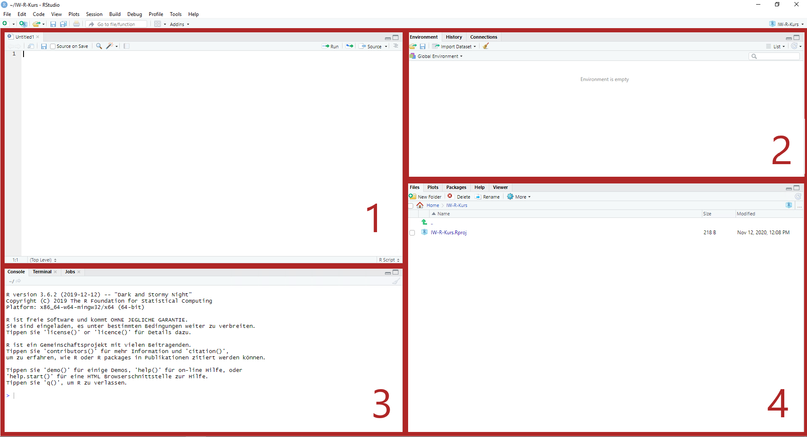
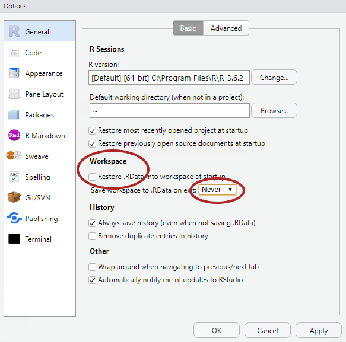

```{r setup, include=FALSE}
knitr::opts_chunk$set(message=FALSE,warning=FALSE, cache=TRUE)
```

# Ziele der Sitzung

1. Gutes Verständnis von R in RStudio

  * Erstellung eines Projektes
  * Verständnis der Grundfunktion
  * Erweiterte Einstellungen

2. Know-How im Tidyverse

# R und RStudio installieren 

Wenn IW-Laptops benutzt werden, sollten R und RStudio bereits von der IT installiert bzw. aktualisiert worden sein. Auf privaten Laptops müssen R und RStudio selbst installiert werden. Falls sich schon ältere Versionen auf den Laptops befinden, sollten diese auf die untenstehnden Versionen aktualisiert werden:

* Für **R** wird **Version 4.0.3** (Bunny-Wunnies Freak Out) verwendet ([Link](https://ftp.fau.de/cran/))
* Für **RStudio** sollte **Version 1.3.1093** verwendet werden ([Link](https://rstudio.com/products/rstudio/download/#download))

Die Kursinhalte können ggf. auch mit älteren Version bearbeitet werden. Für eine Minimierung möglicher Fehler macht es aber Sinn, dass alle Kursteilnehmer mit den gleichen Versionen arbeiten. 

# RStudio verstehen

RStudio ist ein integrierte Entwicklungsumgebung (IDE) und graphische Benutzeroberflächer für R. [RStudio](https://rstudio.com/) ist als lokale Desktop-Version, als Server Version und auch in der Cloud verfügbar. Auch wenn R und R-Skripte auch über die Konsole gestartet werden können, bietet R-Studio einige Komfortfunktionen, die die Datenanalyse vereinfachen. Diese Funktionen umfassen unter anderem die Organisation von Analysen und Daten in Projekten (siehe Kapitel 1.3), die Möglichkeit Datensätze interaktiv zu betrachten, die Visualisierung von Daten und etwa die direkte Integration von Versionsverwaltung mit [Git](https://git-scm.com/). 

# Das Layout von R-Studio
<center>

{width=75%}

</center>

Das Grundlayout von R-Studio besteht aus vier Fenstern. Diese sind wie oben
angeordnet und können funktional folgendermaßen unterschieden werden:

* Fenster 1: Das Fenster enthält das Hauptskript oder ggf. den Viewer (hiermit können Datensätze (ohne Schreibfunktion) betrachtet werden)

* Fenster 2: Beinhaltet die Umgebungsübersicht. Alle Objekte und Variablen die erstellt wurden, können hier betrachtet werden.

* Fenster 3: Hier befindet sich die Konsole.

* Fenster 4: Beinhaltet ein Übersicht über alle Dateien im Ordner / Plots / Pakete / oder die Hilfe.

Über 'Tools > Global Options > Pane Layout' können diese Fenster nach belieben angeordnet und ein- bzw. ausgeblendet werden. 


# Erweiterte Einstellungen

Wenn man R-Studio das erste mal benutzt, macht es Sinn, einige Einstellungen zu verändern, die standardmäßig eingestellt sind. 

Hier macht es Sinn, sich unter 'Tools > Global Options' einmal die verschiedenen Optionen anzuschauen. 

<center>

{width=50%}

</center>

Zwei wichtige Einstellungen sind (unserer Meinung nach):

1. den Haken bei "Restore .RData into workspace at start-up" zu entfernen und 
2. die Option bei "Save workspace to .RData on exit" auf "Never" zu setzen. 

In Einzelfällen kann es sinnvoll sein, Daten und Zuweisungen aus der letzten Sitzung automatisch in der nächsten Sitzung zu importieren. Öfter kann dies aber zu Verwirrung oder sogar zu Fehlern führen. 

Des Weiteren macht es Sinn, sich unter 'Tools > Global Options > Appearance' mit den verfügbaren Optionen auseinanderzusetzen. Hier lassen sich etwa Schriftart und -größe sowie das generelle Theme von R-Studio einstellen. Wenn man längere Zeit vor R-Studio sitzt (was durchaus zu empfehlen ist), kann es Sinn machen, einen Darkmode zu nutzen, um die Augen zu schonen. 


# Erstellung von Projekten

