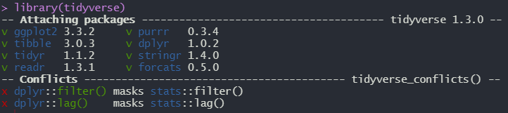
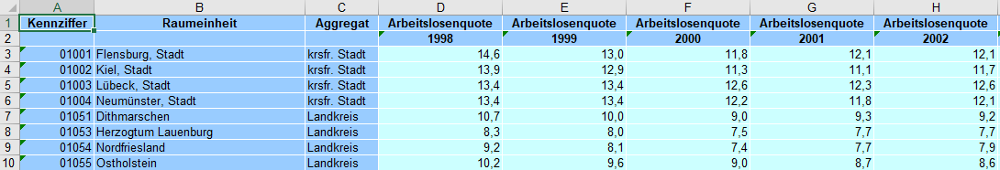
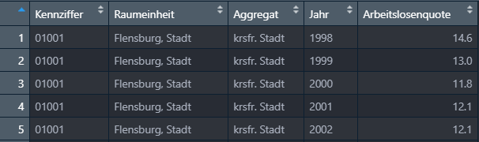

```{r setup, include=FALSE}
knitr::opts_chunk$set(message=FALSE,warning=FALSE, cache=TRUE)
```

---- 

# Ziele der Sitzung

* Grundverständnis der tidyverse
* Laden verschiedener Dateiformate
* Bearbeiten von Daten
* Verstädnnigs von Pipes (%>%)
* Übergang in ggplot2

----

# Was ist das tidyverse?

Das [tidyverse](https://www.tidyverse.org/) in R ist eine Sammlung von Paketen, denen dieselbe Repräsentation von Daten ([tidy data](https://vita.had.co.nz/papers/tidy-data.pdf)) zu Grunde liegen und die ein gemeinsames API Design nutzen. "Tidy data" umschreibt "aufgeräumte" bzw. "saubere" Daten und damit Daten, die so aufbereitet sind, dass jede Variable in einer Spalte und jede Beobachtung in einer Reihe repäsentiert wird. Die Pakete und Funktionen des tidyverse können die oft sperrigen und schwer verständlichen Base-R Funktionen fast vollständig ersetzen und bieten einen intuitiven Einstieg in die Analyse und Visualisierung von Daten. 

----

# Installation und Inhalt

Das tidyverse kann über den Befehl <code> install.packages("tidyverse") </code> installiert werden. Wird die Bibilothek in mit <code> library(tidyverse) </code> in die Umgebung geladen, sind die folgenden Pakete direkt nutzbar:

* [ggplot2](https://ggplot2.tidyverse.org), für Datenvisualisierung,
* [dplyr](https://dplyr.tidyverse.org), für Datenbearbeitung,
* [tidyr](https://tidyr.tidyverse.org), für das Säubern von Daten,
* [readr](https://readr.tidyverse.org), für den Import von Daten,
* [purrr](https://purrr.tidyverse.org), für funktionales Programmieren,
* [tibble](https://tibble.tidyverse.org), für Tibbles (eine Art DataFrame),
* [stringr](https://github.com/tidyverse/stringr), für Strings,
* [forcats](https://github.com/hadley/forcats), für Faktor-Variablen.

Neben den bisher genannten Paketen, die sofort genutzt werden können, wenn das tidyverse-Paket geladen wird, installiert der Befehl <code> install.packages("tidyverse") </code> weitere Pakete. Diese werden seltener gebraucht, sind aber doch so gebräuchlich, dass sie direkt mit installiert werden. Über den <code> library("Paketname") </code> Befehl müssen diese allerdings je nach Anwendungsbedarf zusätzlich in die Arbeitsumgebung geladen werden. Diese mit installierten Befehle umfassen:

*   Für die Arbeit mit Daten mit zeitlichem Bezug:

    * [hms](https://github.com/rstats-db/hms), für Uhrzeiten,
    * [lubridate](https://github.com/tidyverse/lubridate), für Datums/Zeit-Transformationen.
    
    
*   Für den Import weiterer Datenformate:

    * [feather](https://github.com/wesm/feather), für das Teilen von Daten mit Python und weiteren Programmiersprachen,
    * [haven](https://github.com/tidyverse/haven), für SPSS, SAS and **Stata** Daten
    * [httr](https://github.com/r-lib/httr), für Web-APIs,
    * [jsonlite](https://github.com/jeroen/jsonlite) für JSON,
    * [readxl](https://github.com/tidyverse/readxl), für `.xls` und `.xlsx` Dateien,
    * [rvest](https://github.com/tidyverse/rvest), für Web-Scraping,
    * [xml2](https://github.com/r-lib/xml2), für XML

*   Modellierung

    * [broom](https://github.com/tidymodels/broom), für das Säubern / Auslesen von Modellobjekten.
    
----
    
## Mögliche Probleme

Lädt man das tidyverse in die Arbeitsumgebung, wird folgende Nachricht angezeigt:

<center>

{width=75%}

</center>

Einerseits werden hier unter "Attaching packages" die geladenen Pakete samt der jeweiligen Version angezeigt. Unter "Conflicts" gibt es zudem zwei Warnhinweise. Diese weisen auf mögliche Probleme bei der Nutzung verschiedener R-Pakete hin. Hier werden durch das Laden des tidyverse zwei Befehle aus der "stats-Bibliothek" maskiert, also überschrieben. Konkret bedeutet das, dass nachdem das tidyverse geladen wurde, die Befehle <code> filter() </code> und <code> lag() </code> ihre Funktionalität aus dem "dplyr-Paket" und nicht mehr von "stats" beziehen. Möchte man jetzt die <code> filter() </code> Funktion aus der stats-Bibliothek nutzen, kann man diesen folgendermaßen aufrufen <code> stats::filter() </code>.

```{r filter_explanation, eval=FALSE}
# Lädt nur die filter() Funktion von dplyr
dplyr::filter()

# Lädt alle (!) Funktionen von dplyr und nutzt dann filter()
library(dplyr)
filter()
```

---- 

# Datenmanagement im tidyverse

Das tidyverse bietet ein kohärentes Framework, in welchem Daten intuitiv in ein gewünschtes Format übertragen werden können. Zunächst wird das Konzept von "Tidy Data" erklärt und anschließen ein Beispieldatensatz von Arbeitslosenzaheln in deutschen Landkreisen geladen.

----

## Tidy Data

"Tidy data" umschreibt "aufgeräumte" bzw. "saubere" Daten und damit Daten, die so aufbereitet sind, dass jede Variable in einer Spalte und jede Beobachtung in einer Reihe repäsentiert wird. Es ist wichtig, das Konuzept von tidy data zu verstehen, da alle Pakete im tidyverse darauf basieren. Im tidy data Format sollte ein Datensatz von den folgenden, zusammenhängenden Regeln beschrieben werden können:

1. Jede Variable muss in einer eigenen Spalte sein
2. Jede Beobachtung muss eine eigene Zeile haben
3. Jeder Wert muss eine eigene Zelle haben

Im folgenden Kapitel werden diese Regeln anhand eines Beispiels verdeutlicht.

----

## Laden der Daten

In ihrer ursprünglichen Form sehen die Daten folgendermaßen aus:

<center>

{width=100%}

</center>

Hier sieht man, dass sich die obene genannten Regeln für tidy data nicht anwenden lassen. Während die Variablen "Kennziffer", "Raumeinheit" und "Aggregat" korrekt in einer Spalte gespeichert wurden, wurden die Variablen "Arbeitslosenquote" und "Jahr" auf mehrere Spalten (ins wide format) aufgeteilt. Dadurch hat jede Beobachtung (also die Arbeitslosenquote einer Raumeinheit pro Jahr) auch nicht eine eigene Zeile. Der folgende R-Code lädt die Daten und überführt sie in ein tidy data Format. 

```{r load_data}
library(tidyverse)

# Laden der Daten
Arbeitslosenquote <- 
  readxl::read_xls('daten_beispiele/Arbeitslosenquote.xls',
                         skip = 1) %>% 
  rename('Kennziffer' = '...1',
         'Raumeinheit' = '...2',
         'Aggregat' = '...3') %>% 
  pivot_longer(!c(Kennziffer, Raumeinheit, Aggregat), 
               names_to = 'Jahr', 
               values_to = 'Arbeitslosenquote')
```
Hier wird zunächst mit <code> read_xls() </code> die .xls-Datei geladen. Da das Paket readxl zwar im tidyverse mit heruntergeladen aber nicht automatisch in die Arbeitsumgebung geladen wird, wird das Paket hier mit <code> readxl::read_xls() </code> direkt angesprochen. Der Zusatz <code> skip = 1 </code> überspringt die erste Zeile der .xls-Datei, da die Variabelnnamen auf zwei Spalten verteilt sind. 

Mit der Funktion <code> rename() </code> werden die fehlenden Variablennamen ergänzt. 

Die letzte Funktion <code> pivot_longer() </code> überführt die restlichen Spalten vom wide ins long Format. Die Funktion wird im späteren Kursverlauf genauer erklärt. 

Der daraus resultierende Datensatz kann mit <code> View(Arbeitslosenquote) </code> im Viewer von R-Studio betrachtet werden.

<center>

{width=80%}

</center>

----

## magrittr-Pipe (%>%)

Das tidyverse lädt automatisch die sogenannte "Pipe" aus dem magrittr-Paket. Die Pipe erlaubt es, Code zu schreiben der einfacher verstehen und zu lesen ist. Wollen wir etwa die fünf kreisfreien Städte mit der höchsten Arbeitslosenquote im aktuellsten Jahr gibt es mehrere Möglichkeiten, diese darzustellen. Eine Möglichkeit wäre, die notwendigen Operationen in neue Objekte zu speichern und diese dann weiterzu bearbeiten. 

```{r bad_example}
Arbeitslosenquote_1 <- filter(Arbeitslosenquote, Aggregat == "krsfr. Stadt")
Arbeitslosenquote_2 <- filter(Arbeitslosenquote_1, Jahr == max(Jahr))
Arbeitslosenquote_3 <- top_n(Arbeitslosenquote_2, 5)
Arbeitslosenquote_4 <- arrange(Arbeitslosenquote_3, desc(Arbeitslosenquote))
Arbeitslosenquote_4

```
Mit der Pipe lässt sich der obige Code wie folgt darstellen. 

```{r good_example}
Arbeitslosenquote %>% 
  filter(Aggregat == "krsfr. Stadt",
         Jahr == max(Jahr)) %>% 
  top_n(5) %>% 
  arrange(desc(Arbeitslosenquote))
```
Vor allem in punkto Lesbarkeit und Kompaktheit bietet die Pipe gegenüber ihren Alternativen große Vorteile. Auch wird hier kein zusätzlicher Arbeitsspeicher verwendent, um Objekte zu speichern, die eigentlich gar nicht benötigt werden. Illustriert am obigen Beispiel, kann man die Pipe folgendermaßen verstehen: 

1. Das aktuelle Datenobjekt wird immer in den nächsten Schritt weitergegeben. Hier wird das Objekt "Arbeitslosenquote" also direkt im auf <code> %>% </code> folgenden Befehl als Datenobjekt verwendet. So entfällt der Schritt, in jeder Funktion vom Format <code> filter(data, variable == "value") </code>, das Datenobjekt (data) mit anzugeben. 

2. Das bearbeitete Objekt wird immer in den nächsten Schritt weitergegeben, ohne dass es zwischengespeichert wird und werden muss. 

Vereinfacht gesagt ist also 

* <code> x %>% f </code> äquivalent zu <code> f(x) </code>
* <code> x %>% f(y) </code> äquaivalent zu <code> f(x , y) </code> und
* <code> x %>%  f %>%  g %>% h </code> äquivalent zu <code> h(g(f(x))) </code> 
 
Vor allem in der explorativen Datenanalyse und beim Erstellen von Visualisierungen ist die Pipe sehr gut geeignet. Bei sehr komplizierten Datenstrukturen, oder sehr vielen Operationen sollte man allerdings auf andere Tools zurückgreifen. 

----

## filter()

Die <code> filter() </code> ermöglicht, wie der Name impliziert, das filtern von Datensätzen nach festgelegten Kriterien. 

```{r filter}
# Filtern nach Aggregat und Arbeitslosenquote
Arbeitslosenquote %>% 
  filter(Aggregat == "Landkreis",
         Arbeitslosenquote > 10)

```

----

## select()

Mit der Funktion <code> select() </code> wählt man alle relevanten Spalten bzw. Variablen aus einem Datensatz aus. 

```{r}
Arbeitslosenquote %>% 
  select(Raumeinheit, Jahr, Arbeitslosenquote)
```


----


## mutate()

Die Funktion <code> mutate() </code> erlaubt es, Spalten bzw. Variablen in einem Datensatz zu verändern oder neue Spalten zu erzeugen. 

```{r mutate}
Arbeitslosenquote %>% 
  select(Raumeinheit, Jahr, Arbeitslosenquote) %>% 
  filter(Jahr == "2007") %>% 
  mutate(Abweichung = Arbeitslosenquote - mean(Arbeitslosenquote))
```
----

## group_by()

<code> group_by() </code> gruppiert bestimmte Variablen in gewünschte Gruppen für nachfolgende Operationen. Viele Funktionen bauen auf <code> group_by </code> auf. 

```{r group_by}
Arbeitslosenquote %>% 
  select(-Kennziffer) %>% 
  filter(Jahr == "1998") %>% 
  group_by(Aggregat) %>% 
  mutate(Quote_Aggr = mean(Arbeitslosenquote))
```


----

## summarise()

<code> summarise() </code> oder <code> summarize() </code> fasst alle Reihen zusammen und gibt eine Zusammenfassung dieser Reihen aus.

```{r summarise}
Arbeitslosenquote %>% 
  select(-Kennziffer) %>% 
  filter(Jahr == "1998") %>% 
  group_by(Aggregat) %>% 
  summarise(Quote_Aggr = mean(Arbeitslosenquote))
```

----

## arrange()

Die Funktion <code> arrange() </code> sortiert die Daten in einer gewünschten Reihenfolge.

```{r arrange}
Arbeitslosenquote %>% 
  select(-Kennziffer) %>% 
  filter(Jahr == max(Jahr)) %>% 
  arrange(Arbeitslosenquote)
```
----

# Übergang in ggplot2

Für das Erstellen von Grafiken mit ggplot2 müssen die Daten im oben beschriebenen tidy data Format sein. Ein guter Workflow beinhaltet deshalb, die Daten mit den oben besprochenen Funktionen in das gewünschte Format zu bringen und dann direkt mit der Pipe nach ggplot zu übergeben. 

Eine beispielhafte erste Grafik, die die Arbeitslosenquote pro Jahr und Aggregat zeigt, könnte folgendermaßen aussehen:

```{r plot_1}
Arbeitslosenquote %>% 
  mutate(Jahr = as.double(Jahr)) %>% 
  group_by(Aggregat, Jahr) %>% 
  summarise(Arbeitslosenquote = mean(Arbeitslosenquote)) %>% 
  ggplot(aes(x = Jahr, 
             y = Arbeitslosenquote, 
             group = Aggregat, 
             col = Aggregat)) +
  geom_line(size = 1.0) +
  theme_minimal()
  
```

Ausführliche Informationen zu Datenvisualisierung in R mit ggplot2 gibt es im anschließenden Kapitel unter "Visualisierung". 

----

# Weiterführende Informationen 

Hier werden eine Reihe von Links mit weiterführenden Informationen zum Datenmanagement mit dem Tidyverse angeführt. Auch wenn dieser Kurs hauptsächlich Datenvisualisierung diskutiert, ist das Datenmanagement und die Transformation von Daten ein zentraler Teil von Datenvisualisierung. Deshalb ist es unerlässlich, sich vertieft mit den wichtigsten dplyr-Funktionen vertraut zu machen und diese regelmäßig zu benutzen. Gute weiterführende Informationsquellen über das Datenmanagement im Tidyverse sind deshalb hier aufgeführt. 

* [R for Data Science (Kapitel 9-21)](https://r4ds.had.co.nz/wrangle-intro.html)

* [Yih Huynh - Guide to R (Kapitel 6 und 7)](https://bookdown.org/yih_huynh/Guide-to-R-Book/basic-data-management.html)

* [dplyr Beschreibung](https://dplyr.tidyverse.org/)