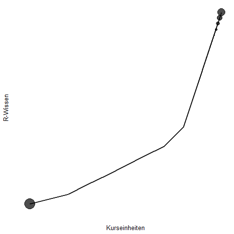

# **Website zum IW-R-Kurs**

Diese Website begleitet den R-Kurs für Datenanalyse und -Visualisierung im IW. Fragen gerne an [Armin Mertens](mailto:armin.mertens@iwkoeln.de?subject=[IW-R-Kurs]) und [Pekka Sagner](mailto:sagner@iwkoeln.de?subject=[IW-R-Kurs]).

# **Ziele des R-Kurses im IW**

Jeder Teilnehmer verfolgt sicher seine eigenen Ziele. Was die Teilnehmer aus der Kursteilnahme mitnehmen könnten:

1. **Wie R funktioniert:** [R](https://www.r-project.org/about.html) ist eine Programmiersprache und kostenfreie Software mit dem Fokus auf statistischen Berechnungen. Der Kurs gibt eine nicht-technische Einführung in die Grundstruktur des *tidyvese* [(mehr)](https://www.tidyverse.org/). Das tidyverse ist eine Sammlung von R-Paketen, die einer gemeinsamen Struktur und Logik folgen. Wichtiger ist: das Coding im tidyverse ist sehr intuitiv.

2. **Wie R-Studio funktioniert:** R-Studio ist eine Entwicklungsumgebung und grafische Benutzeroberfläche für R. Wenn R der Motor ist, dann ist R-Studio das Cockpit [(mehr)](https://rstudio.com/). 

3. **Wie die Datenanalyse funktioniert:** Der Fokus des Kurses liegt zwar auf der Datenvisualisierung, um Daten jedoch visualisieren zu können, müssen wir den ein oder anderen Schritt dahin gehen. Dabei werden das Fundament für die Datenanalyse mit R erklärt.

4. **Wie die Datenvisualisierung funktioniert:** Mit R lassen sich schicke Abbildungen erstellen. Im Kurs wird die "Grammar of Graphics (gg)" genutzt, um einfache und weniger einfache Abbildungen zu erstellen [(mehr)](https://ggplot2.tidyverse.org/).

5. **Wie Animationen funktionieren:** Abbildungen sind zweidimensional: langweilig! Wir erstellen zwar keine aus dem Bildschirm springenden Abbildungen. Allerdings lassen sich Abbildungen durch Animationen eine spannende dritte Dimension geben [(mehr)](https://gganimate.com/articles/gganimate.html).

6. **Bonus:** Es gibt ein R-Paket, mit dem Grafiken im IW Corporate Design erstellen kann. Wir zeigen, was es kann und wie man es benutzt.

### Viel Spaß beim Lernen!

